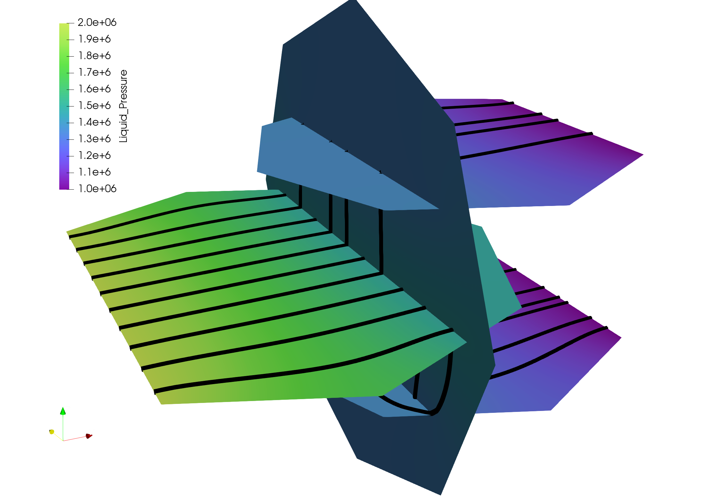
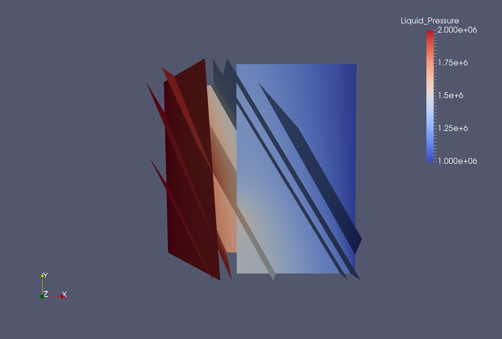

dfnWorks test case tutorial
=============================

This document contains a short, five example, tutorial for dfnWorks. The five test cases provided are for:

- 4_user_defined_rectangles: The user defines the precise location and size of four rectangular fractures.
- 4_user_defined_ellipses: The user defines the precise location and size of four elliptical fractures, where the ellipses are approximated as polygons.
- exponential_dist: The user specifies the parameters for two families of fractures with an exponential distribution of fracture size.
- lognormal_dist: The user specifies the parameters for two families of fractures with a lognormal distribution of fracture size.
- truncated_power_law_dist: The user specifies the parameters for two families of fractures with a truncated power-law distribution of fracture size. 

All required input files for these examples are contained in the folder dfnWorks-Version2.0/tests. The focus of this document is to provide visual confirmation that new users of dfnWorks have the code set up correctly, can carry out the following runs and reproduce the following images. All images are rendered using Paraview, which can be obtained for free at http : //www.paraview.org/. The first two examples are simpler than the last three so it is recommended that the user proceed in the order presented here. 

Before doing anything else
----------------------------

1. Setup the python package, in the folder dfnWorks-Version2.0/pydfnworks/ ::

python setup.py install (if the user has admin privileges), OR:

python setup.py install --user (if the user does not have admin privileges)

2. Set the paths correctly - described in the next section

Setting the paths correctly
------------------------------

Before executing dfnWorks, the following paths must be set. These are in the file dfnWorks-Version2.0/pydfnworks/pydfnworks/paths.py:

- DFNWORKS_PATH: the dfnWorks-Version2.0 repository folder
- PETSC_DIR and PETSC_ARCH: PETSC environmental variables
- PFLOTRAN_DIR: The PFLOTRAN directory
- python_dfn: The location of the Python distribution to use
- lagrit_dfn: The location of the LaGriT executable

Executing dfnWorks
-------------------

To run one of the test cases enter either of the following types of command (INPUT PARAMETERS WILL CHANGE FOR ACTUAL RUNS). Both of the scripts invoked below are in the directory dfnWorks-Version2.0/pydfnworks/bin/ : 

- python test.py [JOBNAME], where name is one of the names above. 
- python run.py -name [JOBNAME] -input [INPUT_FILE] -ncpus [NUMBER_OF_CPUS] -large_network 

The second way of running dfnWorks can be used for any input, not only the examples presented here. The arguments are:

-[JOBNAME]: The name of the run, which is also the folder which will contain the run's output.
-[INPUT_FILE]: An input file with three lines that have input files for dfnGen, dfnFlow, and dfnTrans, respectively. Any of the files with ending .txt in the directory tests can be used as examples of input files. 
-[NUMBER_OF_CPUS]: The number of CPUs that the user would like to use for the parralel computation of the meshing and flow solutions.
-large_network (optional): Only use this flag if the user should use CPP for file processing. 

For example, to run the demo lognormal on 4 CPUs, using C++ for file processing,  the command line input would be either:

python test.py lognormal_dist 

OR

python run.py -name lognormal_dist -input dfnWorks-Version2.0/tests/lognormal_distribution.txt -ncpus 4 -large_network 

Both of these command line inputs will run the lognormal_dist test and create a new folder lognormal_dist where all output files will be located. Descriptions of each output file are in the documentation. The only difference between the command line inputs above is that in the first, parameters such as number of CPUs and the input file are specified in the script test.py, while the second allows the user to specify these parameters on the command line. In the following sections, we provide descriptions of the output you should expect for each of the five examples.

4_user_defined_rectangles
--------------------------

This test case consists of four user defined rectangular fractures within a a cubic domain with sides of length one meter. The input file specifiying the ellipses is in dfnWorks-Version2.0/tests, and is named define_4_user_rectangles.dat. To run the test on 4 cpus, enter the following command line input:

python dfnWorks-Version2.0/pydfnworks/bin/run.py -name 4_user_defined_rectangles -input dfnworks_main/tests/4_user_rectangles.txt -ncpus 4

This will create a new folder, test 4fractures, where all of the output will be located. You can compare your results to the following images.

The network of four fractures, each colored by material ID. The computational mesh is overlaid on the fractures. This image is created by loading the file full_mesh.inp. located in the folder 4_user_defined_rectangles/LaGriT/, into Paraview.

	
The network of four fractures,  colored by pressure solution.  
High pressure (red) Dirichlet boundary conditions are applied on the edge of the single fracture along the boundary x = -0.5, and low pressure (blue) boundary conditions are applied on the edges of the two fractures at the boundary x = 0.5.
This image is created by loading the file 4_user_defined_rectangles/PFLOTRAN/parsed_vtk/dfn_explicit-001.vtk into Paraview.

Particle trajectories on the network of four fractures.   
Particles are inserted uniformly along the inlet fracture on the left side of the image. 
Particles exit the domain through the two horizontal fractures on the right side of the image.  
Due to the stochastic nature of the particle tracking algorithm, your pathlines might not be exactly the same as in this image. 
Trajectories are colored by the current velocity magnitude of the particle's velocity. 
Trajectories can be visualized by loading the files part\_*.inp, in the folder 4_user_rectangles/dfnTrans/trajectories/
We have used the extract surface and tube filters in paraview for visual clarity. 

In the other tests, only a brief description and pictures are provided. 

4_user_defined_ellipses
--------------------------

This test case consists of four user defined elliptical fractures within a a cubic domain with sides of length one meter. In this case the ellipses are approximated using 5 vertices. The input file specifiying the ellipses is in dfnWorks-Version2.0/tests, and is named define_4_user_ellipses.dat. 

|
|

.. image:: figures/4_user_ellipses_pressure.png
   :scale: 100 %
   :alt: alternate text
   :align: center

|
|

|
|

truncated_power_law_dist
-------------------------

This test case consists of two families whose sizes have a truncated power law distribution with a minimum size of 0.5m and a maximum size of 50m. The domain size is cubic with an edge length of 4m. The other input parameters can be found in tests/gen_truncated_power_law_dist.dat.

.. image:: figures/power_mesh.png
   :scale: 100 %
   :alt: alternate text
   :align: center

|
|

|
|

.. image:: figures/power_trace.png
   :scale: 100 %
   :alt: alternate text
   :align: center

exponential_dist
------------------

This test case consists of a family of fractures whose size is exponentially distributed with a minimum size of 1m and a maximum size of 50m. The domain is cubic with an edge length of 10m. All input parameters for the generator can be found in tests/gen_exponential_dist.dat. 

|
|

.. image:: figures/exp_pressure.png
   :scale: 100 %
   :alt: alternate text
   :align: center

|
|

.. image:: figures/exp_trace.png
   :scale: 100 %
   :alt: alternate text
   :align: center

|
|

lognormal_dist
------------------

This test case consists of two fracture families whose sizes have a lognormal distribution with a minimum size of 0.5m and a maximum size of 50m. The domain size is cubic with an edge length of 10m. All input parameters for the generator can be found in tests/gen_lognormal_dist.dat.

|
|

|
|

|
|

