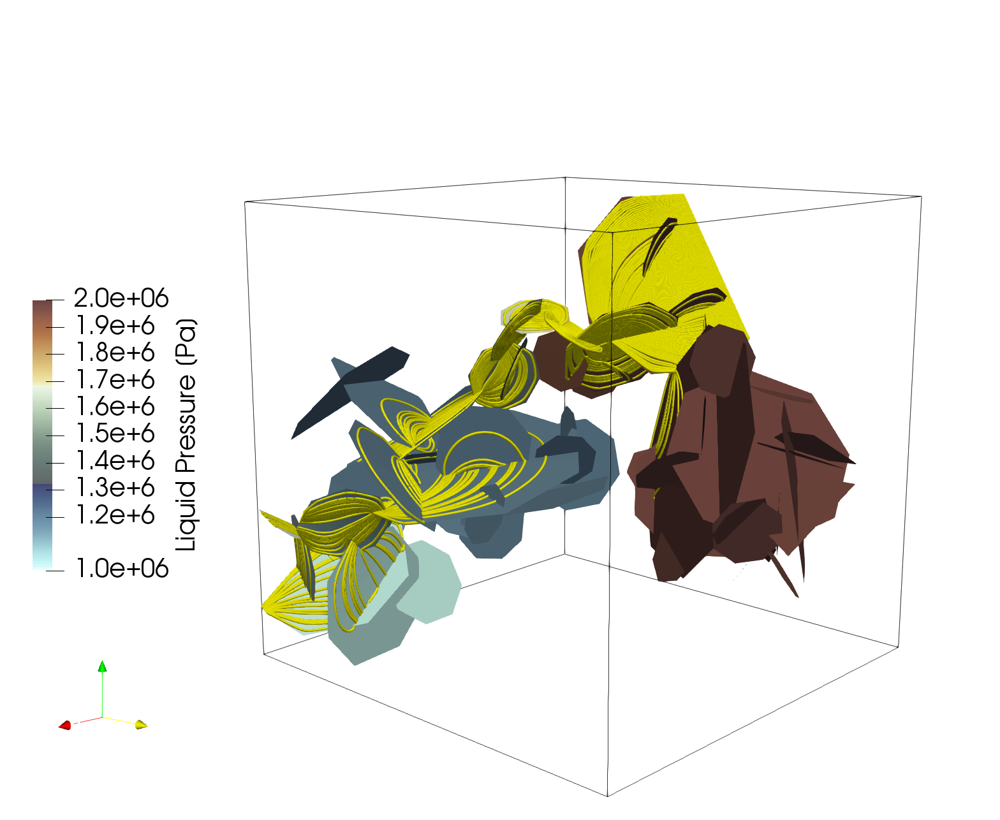
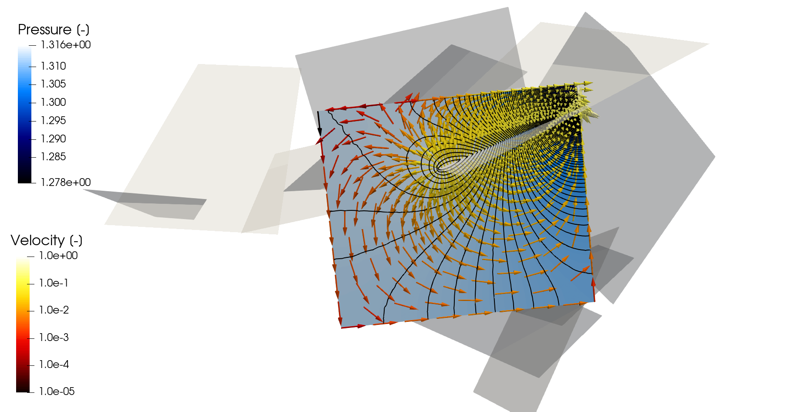
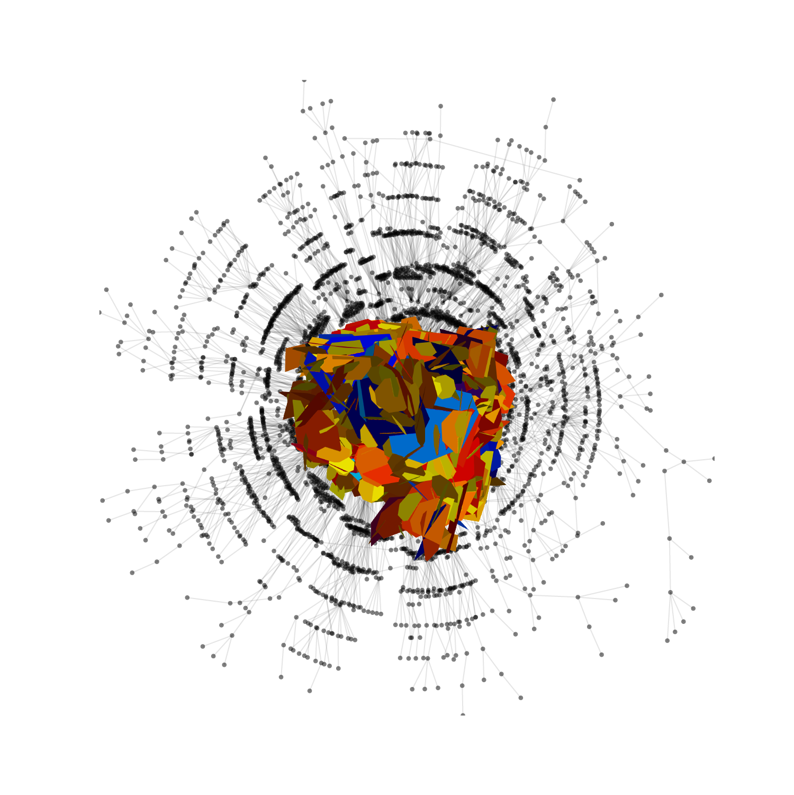
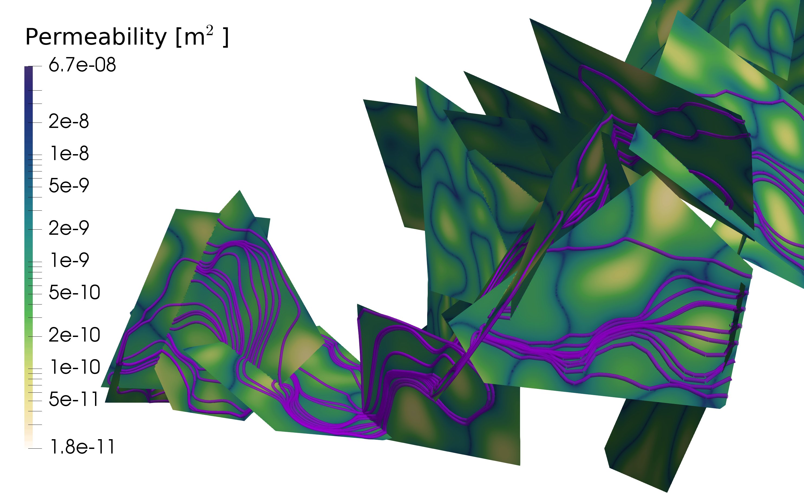

dfnWorks Gallery
=============================

    
   *Particle Pathlines within a DFN composed of fractures whose radii follow a truncated powerlaw. Fractures are colored by Pressure.*

.. figure:: figures/power_mesh.png
   :alt: Figure Not Found
   :align: center
    
   *Mesh of a DFN composed of fractures whose radii follow a truncated powerlaw. Fractures are colored by Pressure.*

.. figure:: figures/well-pressure.png
   :alt: Figure Not Found
   :align: center
    
   *Pressure distribution with a hydraulic fracturing simulation*

    
   *Pressure contours and velocity vector field within a dead-end fracture.*

    
   *DFN along with it's graph representation*

    
   *DFN with internal aperture variability. Particle Pathlines are shown in purple.*

