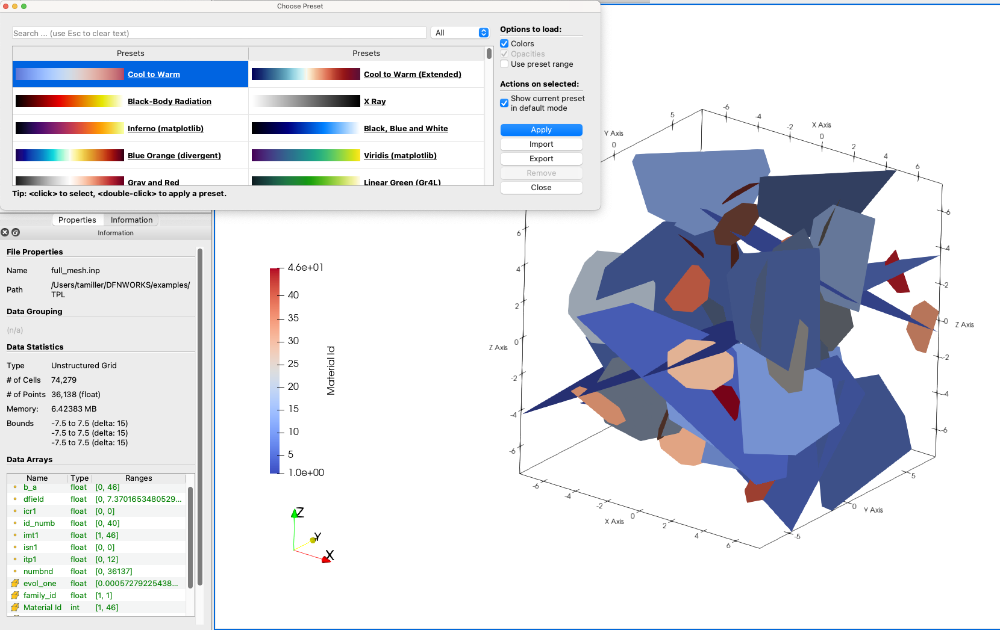
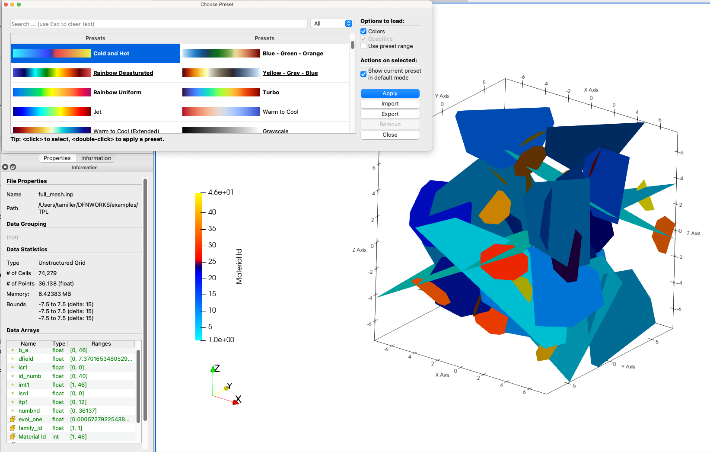
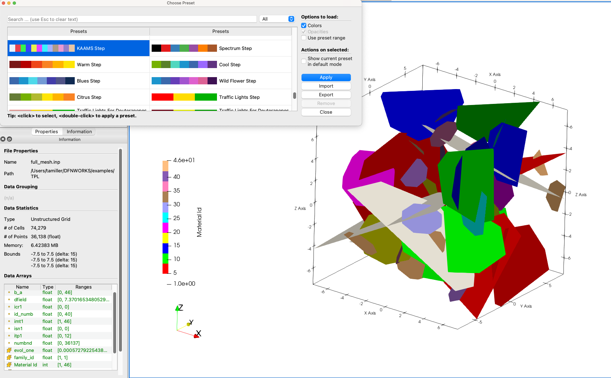
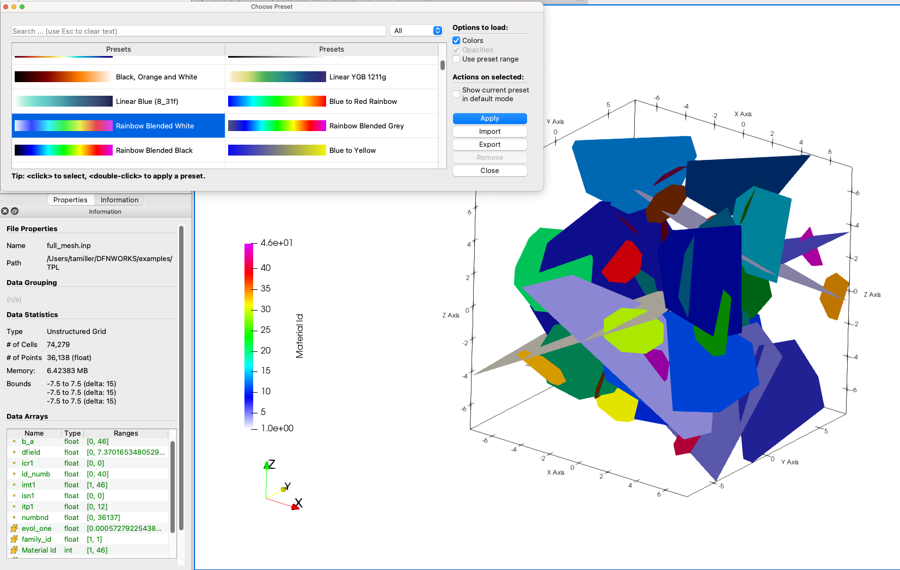
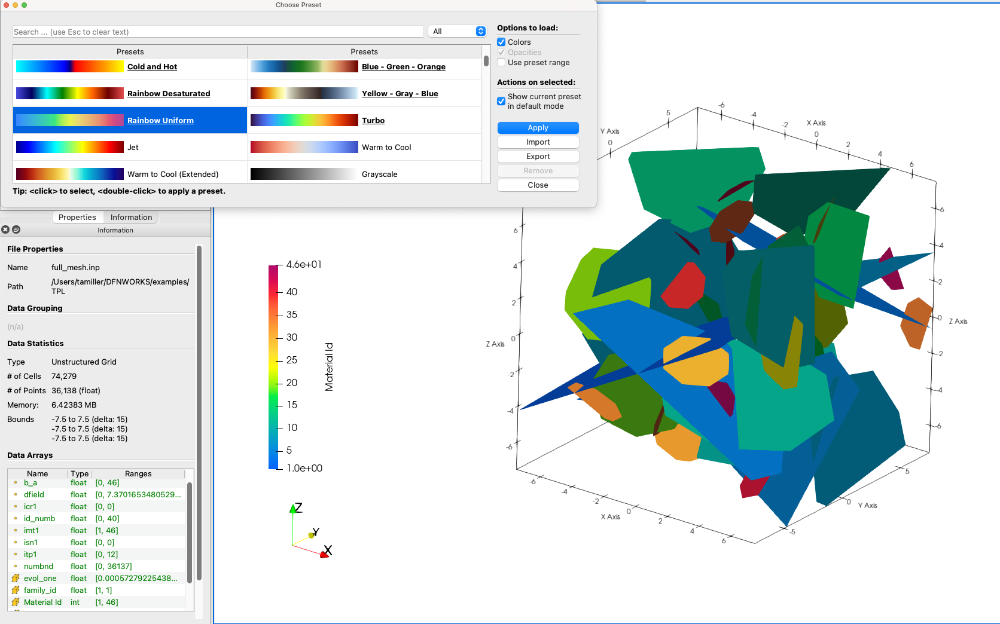
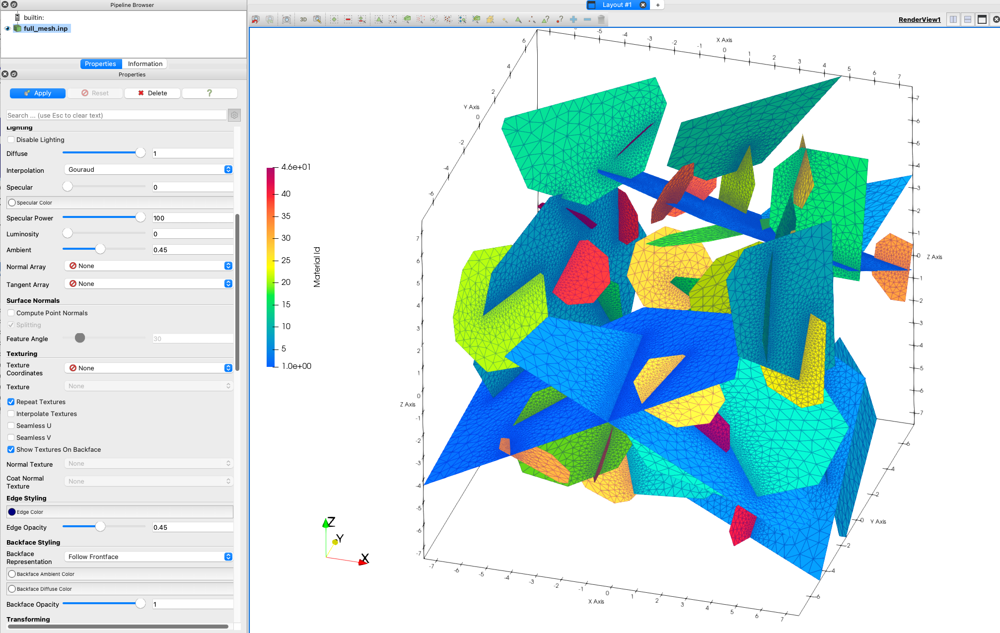

This page shows screenshots from Paraview with display ideas for a network mesh.

Default paraview is cool to warm, blue to red

Colormap cold and hot will seperate the range

Colormap Kaams is a step style that is not blended

Rainbow blended white will give lighter blue tones at low values

Rainbow uniform is most common colormap in general use

Turning edges on can help make fractures more visible, turn down opacity for less busy views

