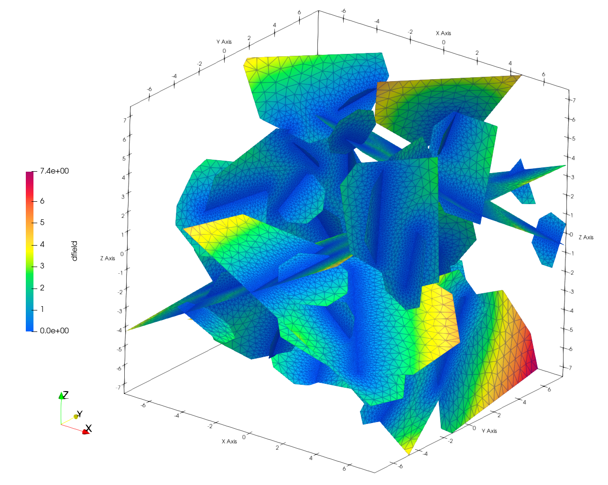
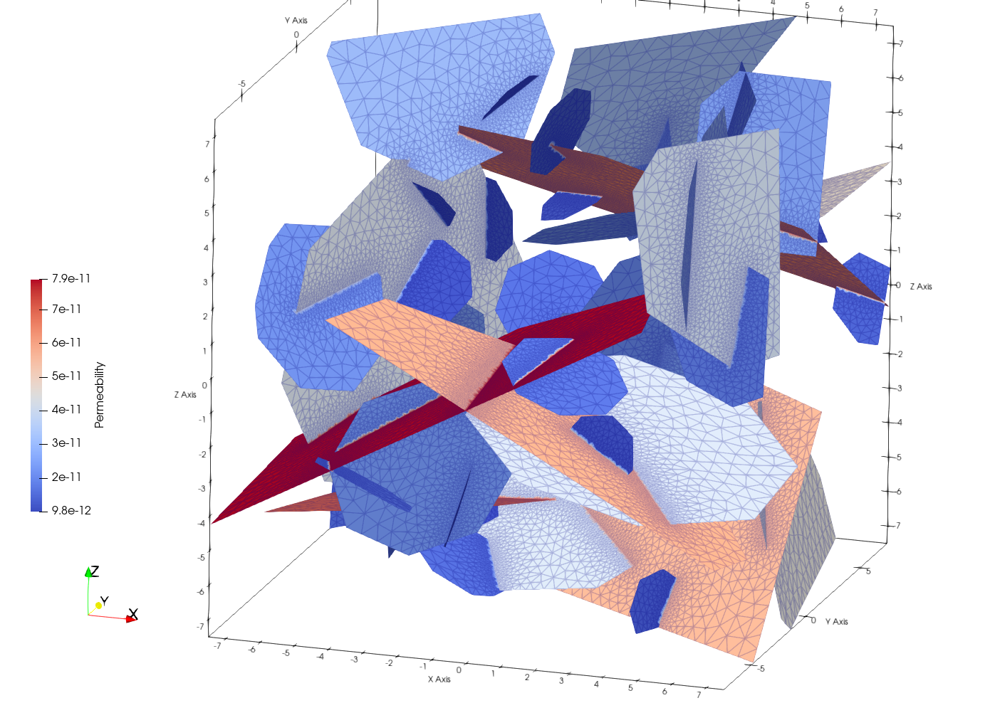
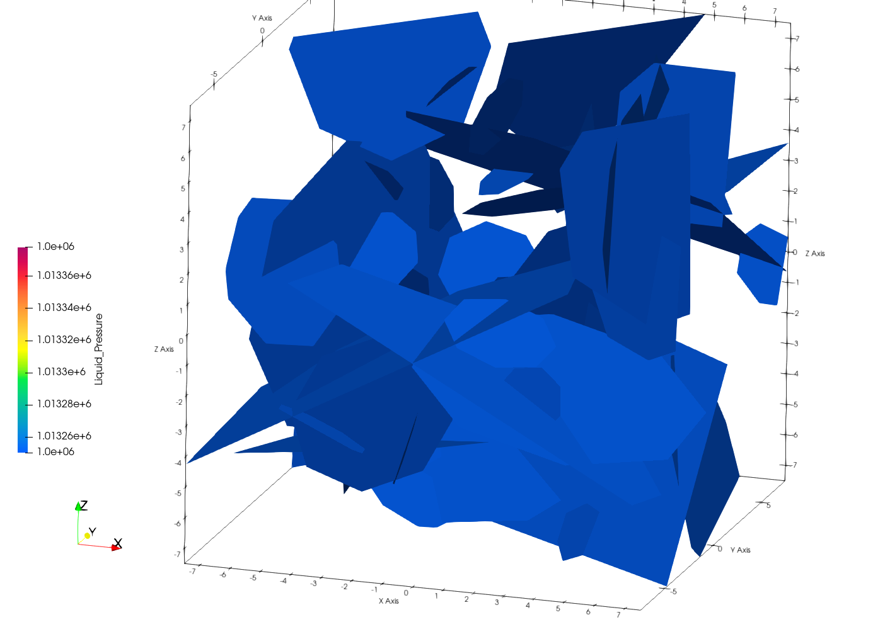
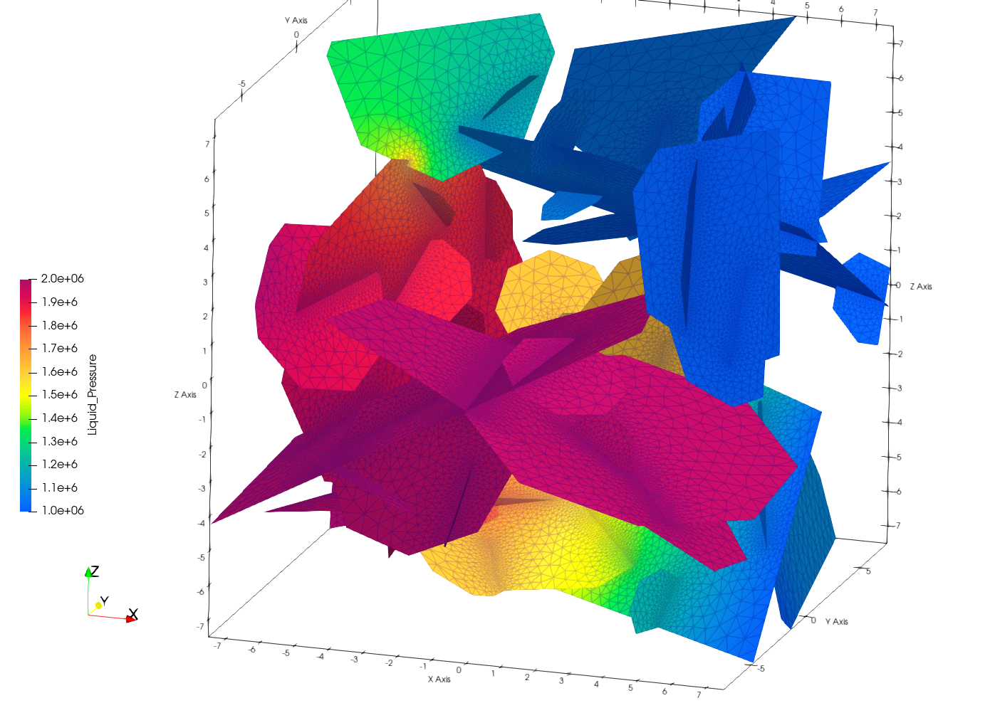
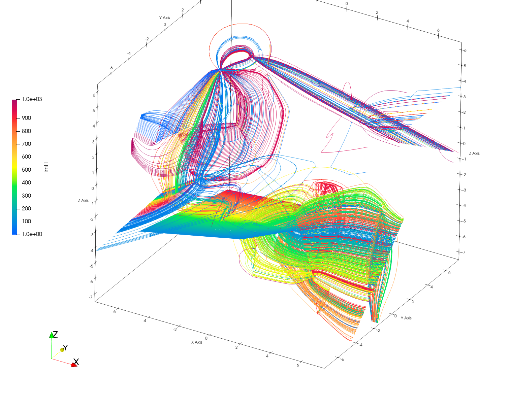
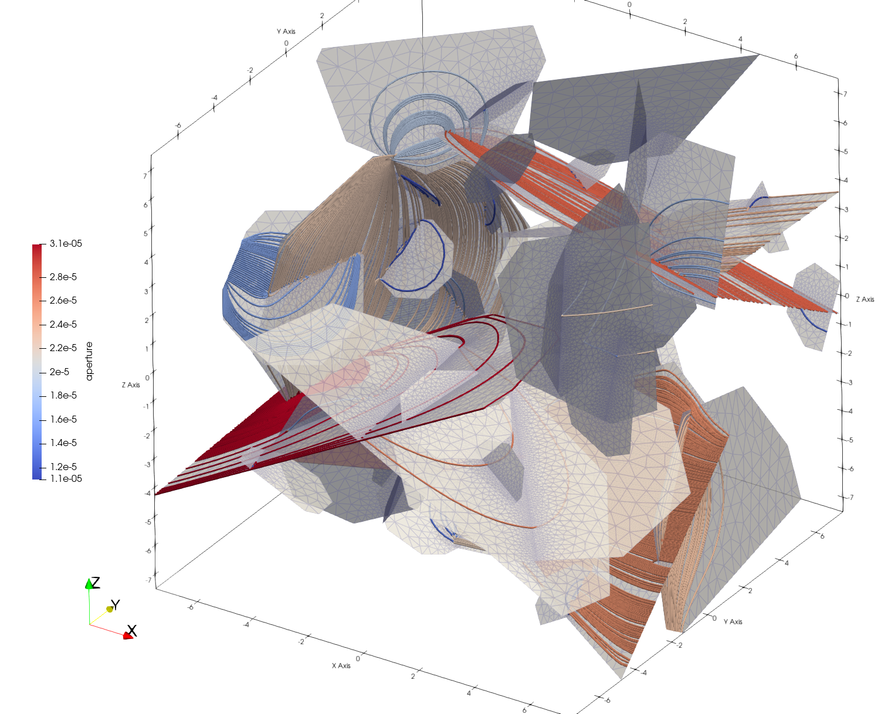
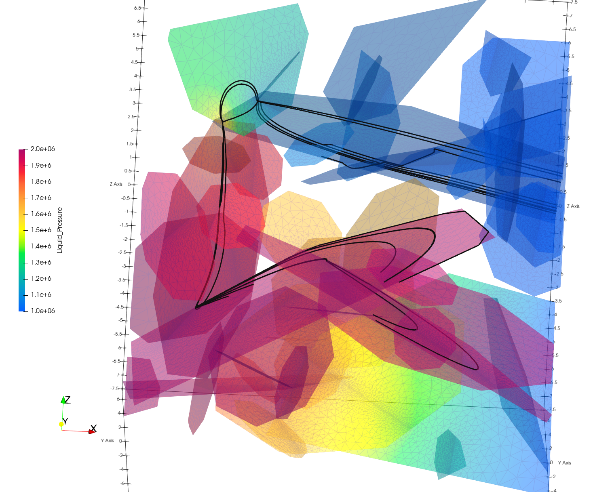

dfnWorks Tutorial for Truncated Power-Law (TPL)
================================================


.. figure:: figures/tpl_3images.png
   :scale: 100 %
   :alt: alternate text
   :align: center


The TPL (Truncated Power-Law) is a type of distribution ('tpl', 'log_normal', 'exp', or 'constant') that defines the sample distribution for the fracture radius.

This example uses add_fracture_family() to control parameters to create a set of fractures within a domain. Fracture families can also be created using add_user_fract() to define specific fractures or add_user_fract_from_file() to read fractures from a file. 

This example consists of one family of fractures whose sizes have a truncated power law distribution with a minimum radius of 1 meter and a maximum size of 10 meters.  


The following items are covered in this Tutorial:

.. contents::
   :depth: 2
   :local:


Tutorial Prerequisites
--------------------------

- For this Tutorial you do not need to run dfnWorks. You can read through the steps for a basic understanding of the work flow. Images and output examples are included with this tutorial.
- This Tutorial assumes you are familiar with the basics of running dfnWorks.  These basics are covered in the Tutorial  [Introduction and Beginner Tutorial](https://lanl.github.io/dfnWorks/tutorial_intro.html) 
For install and setup instuctions, refer to the section at :ref:`pydfnWorks install <pydfnworks-setup>`.
- TeX Live is needed to write the PDF report summary. Local servers use ```module load texlive```
- Paraview_ is an open-source visualization software and is used to create the mesh and simulation images in this document.  Instructions for downloading and installing Paraview_ can be found at http://www.paraview.org/download/ 


dfnWorks TPL Overview
--------------------------

The Truncated Power-Law (TPL) option for stochastic generation of fractures allows spatially variable mesh resolution while enusring Delaunay triangulation for accuracy and stable solutions. Parameters are set by family groupings and include controls for distribution, orientation, and resolution. 

Understanding these parameters will help you effectively describe the geometry and orientation of fractures within your discrete fracture network in dfnWorks. By adjusting these settings, you can model complex geological configurations and accurately represent the flow behavior in fractured media.

This tutorial's main focus will be on **dfnGen** and how to use TPL parameters to generate a network. Evaluations of a network include reports, graphs, and visual inspection. 
See Module at :ref:`dfnGen <dfngen-chapter>` and python docs at :ref:`pydfnWorks: dfnGen <dfnWorks-python-chapter-dfnGen>`


.. figure:: figures/tpl_mesh_material.png
   :scale: 50 %
   :alt: alternate text
   :align: center


Simulations using dfnFlow and dfnTrans are run on the network and are viewed to further evaluate the network and results.

Set Parameters
---------------------------

Open the script python `driver.py`. You can open with any text editor or use the unix command ``cat driver.py`` which will display the content to the screen.  Note the first line of the file imports the `pydfnworks` package. This allows the user to run dfnWorks from the command line and call dfnWorks within other python scripts.

For this example there are 2 ways to run driver.py, this run will create and run simulations with one fracture family. A second fracture family is commented out, uncomment the output directory name and the portion to add_fracture_family and write results in second directory "output2".

This example will run both the flow model and particle tracks using the input files named here.

.. code-block:: python
    jobname = os.getcwd() + "/output"
    #jobname = os.getcwd() + "/output2"

    # These are the input files for PFLOTRAN Flow and Particles
    dfnFlow_file = os.getcwd() + '/dfn_explicit.in'
    dfnTrans_file = os.getcwd() + '/PTDFN_control.dat'
    DFN = DFNWORKS(jobname,
               dfnFlow_file=dfnFlow_file,
               dfnTrans_file=dfnTrans_file,
               ncpu=12)

The domain is a 15 meter cube with 0.1 set as smallest edge size. 

It is good practice to use 'domainSizeIncrease' to avoid edge density effects. This temporary domainSize increase for inserting fracture centers outside of the domain defined by domainSize. After generation is complete, the domain is truncated back to domainSize. First entry is expansion in x (east/west), second entry is expansion in y (North/South), and third entry is expansion in z (Top/Bottom). 

The parameter 'boundaryFaces' selects domain boundaries for flow. The generation will only keep clusters of fractures with connections to domain boundaries which are set to 1 as indicated by axis directions [ +X,-X,+Y,-Y,+Z,-Z].  The network will have fractures connecting to the left and right boundaries.


.. code-block:: python
    DFN.params['domainSize']['value'] = [15, 15, 15]
    DFN.params['h']['value'] = 0.1

    # Define a buffer space around the domain
    DFN.params['domainSizeIncrease']['value'] = [0.5, 0.5, 0.5]

    DFN.params['keepOnlyLargestCluster']['value'] = True
    DFN.params['ignoreBoundaryFaces']['value'] = False
    DFN.params['boundaryFaces']['value'] = [1, 1, 0, 0, 0, 0]
    DFN.params['seed']['value'] = 2


Python add_fracture_family()
-----------------------------


This example creates a single family network. The routine **add_fracture_family()** is assigns all the parameters for a fracture network filling the domain.

.. code-block:: python

    DFN.add_fracture_family(
        shape="ell", distribution="tpl", alpha=1.8, p32=1,
        min_radius=1.0, max_radius=10.0,
        kappa=1.0, theta=0.0, phi=0.0,
        hy_variable='aperture', hy_function='correlated', number_of_points=8,
        hy_params={
            "alpha": 10**-5,
            "beta": 0.5
        })

These parameters help define the characteristics and distribution of fractures within your discrete fracture network.

distribution 
~~~~~~~~~~~~~

The distribution parameter defines the statistical distribution from which the fracture radii will be sampled. Options include:

- **'tpl'**: Truncated Power Law distribution.
- **'log_normal'**: Log-normal distribution.
- **'exp'**: Exponential distribution.
- **'constant'**: A constant value for the fracture radius.


alpha 
~~~~~~~~~~~~~

This is a parameter used when the distribution is set to tpl. It indicates the power-law exponent of the truncated power-law distribution.
Use this parameter to define the specific scaling behavior of the fracture sizes in a power-law context. This can help model situations where smaller fractures are more common than larger ones, which is typical in many geological settings.


p32
~~~~~~~~~~~~~

This represents the fracture intensity for the family. It is applicable when using stopCondition = 1, which typically refers to a specified density of fractures.  The value of p32 relates to the number of fractures per unit volume or area.


shape and radius 
~~~~~~~~~~~~~

The shape parameter defines the fracture family to **'rect'** rectangle or **'ell'** ellipse. Their sizes are set with **'min_radius'** and **'max_radius'**


kappa, theta, phi
~~~~~~~~~~~~~

These parameters enable users to define density and orientations for fractures within a discrete fracture network. This family sets kappa, theta, and phi. Other scenarios may use parameters such as trend, plunge, dip, and strike. 

- **'kappa'**: Sets concentration parameter for the von Mises-Fisher distribution, which is used for modeling directionality of fractures. Higher values indicate a tighter clustering of the fracture orientations around the mean direction.
- **'theta'** : This parameter defines the angle used to specify the orientation of fractures. For example  orientation set to 0 (the default) would represent horizontal fractures  while a value of π/2 (90 degrees) would indicate a vertical fracture.
- **'phi'** : Similar to theta, phi is used to specify the azimuthal angle of the fracture in spherical coordinates. This angle defines the rotation around the vertical axis.  For example, a value of 0 for phi would mean the fracture is pointing along the positive x-axis, while a value of π/2 would indicate it’s pointing along the positive y-axis.


hy_variable
~~~~~~~~~~~

The hydraulic parameters hy_variable, hy_function, and hy_params—are essential for modeling how fluid flows through fractured media. By carefully selecting and defining each parameter, you can create a more accurate and realistic representation of subsurface flow behavior influenced by the fractures in your model.

This hydraulic parameter specifies the variable to which values will be assigned for the fractures within the family. The options include:

- **'aperture'** :  The opening width of the fractures, which is critical for determining flow rates.
- **'permeability'** : A measure of how easily fluids can pass through the fractures.
- **'transmissivity'** : Represents the ability of the fractured medium to transmit fluid, influenced by both aperture and permeability.


hy_function
~~~~~~~~~~~


This parameter describes the relationship between the chosen hydraulic variable and the radius of the fractures. Select the appropriate function depending on the relationship you wish to model. For example, if you expect that larger fractures will have higher permeabilities, you might choose 'correlated'.  The options include:

- **'correlated'** : Indicates a direct relationship where the hydraulic variable changes in correlation with changes in fracture radius.
- **'semi-correlated'** : Suggests a relationship where the hydraulic variable is influenced by the fracture radius but also incorporates some variability or randomness.
- **'constant'** : Means that the hydraulic variable does not change with fracture radius and remains fixed at a specific value.
- **'log-normal'** : Implies that the hydraulic variable follows a log-normal distribution, with values spread around a mean influenced by the fracture radius.


hy_params
~~~~~~~~~


This parameter provides the necessary values that define the hydraulic function chosen. The structure of hy_params will vary depending on the hydraulic function selected:

If hy_function is 'correlated' : Expected syntax: {"alpha": value, "beta": value} Here, alpha defines the scaling relationship between the hydraulic variable and the fracture radius, while beta can adjust the slope of the correlation.

If hy_function is 'semi-correlated' : Expected syntax: {"alpha": value, "beta": value, "sigma": value} In this case, sigma adds variability to the relationship, allowing for some randomness in hydraulic properties.

If hy_function is 'constant' : Expected syntax: {"mu": value}


For more details on fracture famililies and a complete list of parameters and functions see [pydfnworks: dfnGen](https://lanl.github.io/dfnWorks/pydfnGen.html)


Network Evaluations
--------------------------

The most immediate feedback for your created network are text reports written to the log file. Additional graphs and statistics can be generated into a nice PDF report with plots.

The following commands will check for errors in the parameters and setup, create the fracture network, writee at PDF report, then triangulate and intersect fractures into a Delaunay mesh.

*Important if using FEHM: PFLOTRAN is the default, set the solver type to ensure the appropriate files and formats are written for the simulation. Add ```DFN.set_flow_solver("FEHM")``` before mesh_netork.* 


.. code-block:: python

    DFN.check_input()
    DFN.create_network()
    DFN.output_report()
    DFN.mesh_network(min_dist=1, max_dist=5, max_resolution_factor=10)


Log Report
~~~~~~~~~~~~~~~~~~~

See output.log

Observe screen output as dfnWorks is running, error checks and setup results are displayed. This is the first place to check that your network is as expected. The screen output is also written to root_name.log. For this example the output will look like the following.

While dfnWorks is running, you will see extensive reporting to the screen. This will alert you to errors or missing files. When finished, a report is written to to file `output.log`. This is the first place to check if there are any issues. Look for the first occurrence of Errors as later Errors are likely caused by the first. Warnings may exist and can usually be ignored.

A list of dfnWorks files and their descriptions are at :ref:`dfnWorks Files <output-chapter>`.

The log will write a summary that includes default and user defined parameters. Check this is what was expectted for your setup. For this example: 


.. code-block:: bash

    2025-05-22 13:26:52,217 INFO Checking Input File Complete
    2025-05-22 13:26:53,167 INFO [2025-05-22 13:26:52] INFO: Starting DFNGen
    [2025-05-22 13:26:52] INFO: Expecting Theta and phi for orientations
    [2025-05-22 13:26:52] INFO: h: 0.100000
    [2025-05-22 13:26:52] INFO: Shape Families:
    [2025-05-22 13:26:52] INFO: Ellipse Family 1:
    [2025-05-22 13:26:52] INFO: Number of Vertices: 8
    [2025-05-22 13:26:52] INFO: Aspect Ratio: 1.000000
    [2025-05-22 13:26:52] INFO: P32 (Fracture Intensity) Target: 1.000000
    [2025-05-22 13:26:52] INFO: Beta Distribution (Rotation Around Normal Vector): [0, 2PI)
    [2025-05-22 13:26:52] INFO: Theta: 0.000000 rad, 0.000000 deg
    [2025-05-22 13:26:52] INFO: Phi: 0.000000 rad, 0.000000 deg
    [2025-05-22 13:26:52] INFO: Kappa: 1.000000
    [2025-05-22 13:26:52] INFO: Layer: Entire domain
    [2025-05-22 13:26:52] INFO: Region: Entire domain
    [2025-05-22 13:26:52] INFO: Distribution: Truncated Power-Law
    [2025-05-22 13:26:52] INFO: Alpha: 1.800000
    [2025-05-22 13:26:52] INFO: Minimum Radius: 1.000000m
    [2025-05-22 13:26:52] INFO: Maximum Radius: 10.000000m
    [2025-05-22 13:26:52] INFO: Family Insertion Probability: 1.000000
    [2025-05-22 13:26:52] INFO: Estimating number of fractures needed...
    [2025-05-22 13:26:52] INFO: Estimated 167 fractures for Ellipse family 1
    [2025-05-22 13:26:52] INFO: P32 For Family 1 Completed


When fractures are generated, they are checked to ensure intersections and that parameters are satisfied. Fractures are rejected if they are isolated, have edges too short or too close, or outside boundary. When the network is created, summary information helps to describe the result. 

P32 is used in discrete fracture network (DFN) modeling and is a measure of fracture abundance in a rock mass, representing the total area of fractures per unit volume. P32 is calculated by summing the areas of all fractures within a given volume and dividing by that volume.

The final P32 of 1.000912, while slightly exceeding the target of 1.000000, indicates that the simulation results are generally satisfactory, showing good agreement with the intended fracture density. Further adjustments can be made if absolute conformity is necessary, but the results suggest successful modeling of the fracture network within acceptable bounds.

Examine the generated fracture network visually and statistically to ensure that the density and distribution of fractures align with geological expectations.

For this example the log output will look similar to this.

.. code-block:: bash

    [2025-05-22 13:26:52] INFO: ========================================================
    [2025-05-22 13:26:52] INFO:             Network Generation Complete
    [2025-05-22 13:26:52] INFO: ========================================================
    [2025-05-22 13:26:52] INFO: Version of DFNGen: 2.2
    [2025-05-22 13:26:52] INFO: Time Stamp: Thu May 22 13:26:52 2025
    [2025-05-22 13:26:52] INFO: Final p32 values per family:
    [2025-05-22 13:26:52] INFO: Family 1 target P32 = 1.000000, Final P32 = 1.000912
    [2025-05-22 13:26:52] INFO: ________________________________________________________


dfnGen Report
~~~~~~~~~~~~~~~~~~~~


Created by DFN.output_report()
see output_output_report.pdf  and directory dfnGen_output_report


A PDF output report is written for the network. Plots of the fracture lengths, locations, orientations are produced for each family. Files are written into “output_dir/family_{id}/”. Information about the whole network are also created and written into “output_dir/network/” Final output report is named “jobname”_output_report.pdf 

*User defined fractures (ellipses, rectangles, and polygons) are not supported at this time.*


.. code-block:: bash

    2025-05-22 13:26:53,194 INFO Creating Report of DFN generation
    2025-05-22 13:26:53,194 INFO --> Gathering Network Information
    2025-05-22 13:26:53,196 INFO --> There is 1 Fracture Family
    2025-05-22 13:26:53,200 INFO --> There are 119 fractures in the domain
    2025-05-22 13:26:53,201 INFO --> There are 46 fractures in the final network
    2025-05-22 13:26:53,209 INFO --> Plotting Information
    2025-05-22 13:26:56,949 INFO --> Plotting Fracture Radii Distributions
    2025-05-22 13:26:58,940 INFO --> Plotting Rose Diagrams and Stereonets
    2025-05-22 13:26:58,985 INFO --> Plotting Densities
    2025-05-22 13:27:02,448 INFO --> Combing Images and Making PDF
    2025-05-22 13:27:02,449 INFO --> Making Table of Contents
    2025-05-22 13:27:06,588 INFO --> Output report is written into output_output_report.pdf


When working with dfnWorks, the generated reports provide valuable insights into the created discrete fracture network (DFN). Below are descriptions of the different visualizations commonly included, such as the plot of fracture radii distribution, Rose Diagrams, Stereonets, and density plots.

- Radii Distribution : This plot displays the distribution of radii of the fractures within the network. It typically shows the frequency of fractures against their corresponding radii on the x-axis.  A normal distribution might indicate that most fractures are of average size, while very few are extremely small or large.  A truncated power law could suggest that smaller fractures are more common, with larger fractures being rarer.
- Rose Diagrams : A Rose Diagram (or Rose Plot) represents the directional distribution of fractures. It visualizes the number of fractures or their orientations in relation to a specified reference direction. This can help identify preferred orientations in the fracture network.  Peaks in the diagram indicate directions with a higher concentration of fractures.
- Stereonets : A Stereonet plots the orientations of fractures in a three-dimensional context, often represented on a two-dimensional plane. It allows for a clearer understanding of how fractures are situated in space with respect to their dip and strike.  Patterns may reveal structural controls on fracture formation, like fault systems or fold axes.
- Density Plot : A density plot visualizes the concentration of fractures in space, often represented as a 2D or 3D distribution of fracture density per unit area or volume.  High-density regions suggest areas with greater connectivity and potential for fluid movement, while low-density areas might correspond to barriers against flow.


.. figure:: figures/tpl_report_page_2.png
   :width: 450px 
   :alt: PDF report page 2 
   :align: center


   *dfnWorks routine DFN.output_report() creates a PDF summary of the network similar to this image.*


Visual Inspection
~~~~~~~~~~~~~~~~~~~

Created by DFN.mesh_network()
Meshed network to be used by simulations.
See full_mesh.inp (or reduced_mesh.inp)

If the network has been successfully triangulated and merged, the mesh will be written to an AVS format mesh file. The output log will look like:


.. code-block:: bash

    2025-05-22 13:27:06,589 INFO Meshing DFN using LaGriT : Starting
    2025-05-22 13:27:06,608 INFO --> Variable Mesh Resolution Selected
    2025-05-22 13:27:06,608 INFO *** Minimum distance [m] from intersection with constant resolution h/2 : 0.1
    2025-05-22 13:27:06,608 INFO *** Maximum distance [m] from intersection variable resolution : 0.5
    2025-05-22 13:27:06,608 INFO *** Upper bound on resolution [m] : 1.00
    2025-05-22 13:27:16,061 INFO --> The primary mesh in full_mesh.inp has 36138 nodes and 74279 triangular elements
    2025-05-22 13:27:16,794 INFO Meshing DFN using LaGriT : Complete


View the mesh attributes to check parameters. The following images from Paraview show mesh attributes:
 
-   Materials are the fractures generated 1 through n.
-   Property evol_one are the element volumes
-   Property dfield is the linear distance from intersections and is used for element size changes.


.. figure:: figures/tpl_mesh_material.png
   :width: 500px
   :alt: Mesh Materials 
   :align: center

.. figure:: figures/tpl_mesh_evol_one.png
   :width: 500px
   :alt: Mesh Volumes
   :align: center




You can adjust color maps and opacity for views that help display the meshed network for evaluations. Paraview is used for these views.  See more Paraview images in `tpl_paraview_examples.rst <tpl_paraview_examples.rst>`_ 


Run Flow Model
---------------

The pydfnworks command `dfn_flow()` is used to run the simulation. This can provide insights into the behavior of fluids within the fractured network.

See Module at :ref:`dfnFlow <dfnflow-chapter>` and python docs at :ref:`pydfnWorks: dfnFlow <dfnWorks-python-chapter-dfnFlow>`


See PFLOTRAN user manaul at https://www.pflotran.org/documentation/user_guide/user_guide.html

View the PFLOTRAN input deck defined by dfnFlow_file 'dfn_explicit.in'. This is a PFLOTRAN input file.  The input defines inflow and outflow regions using the *.ex boundary files written during the dfnGen step. High pressure (red) Dirichlet boundary conditions are applied on the edge of the fractures along the boundary X = -7.5, and low pressure (blue) boundary conditions are applied on the edges of the fractures at the boundary X = 7.5. 

As the driver runs PFLOTRAN you will see information about the command line calling PFLOTRAN and information about the output files.  

.. code-block:: bash

    2025-05-22 13:27:17,476 INFO --> Running PFLOTRAN
    2025-05-22 13:27:17,481 INFO --> Running: /home/jhyman/src/petsc/arch-linux-c-opt/bin/mpirun -np 12 /home/jhyman/src/pflotran/src/pflotran/pflotran -pflotranin dfn_explicit.in
    2025-05-22 13:27:22,210 INFO --> Processing file: dfn_explicit-000.vtk
    2025-05-22 13:27:22,302 INFO --> Processing file: dfn_explicit-001.vtk
    2025-05-22 13:27:22,377 INFO --> Parsing PFLOTRAN output complete


The simulation results can be viewed with vtk files written in the directory output/parsed_vtk. The following images were created with Paraview:

-  Read dfn_explicit-000.vtk select  Permeability at time 0
-  Read dfn_explicit-000.vtk select  Liquid Pressure at time 0
-  Read dfn_explicit-001.vtk select  Liquid Pressure at time 1









Run Transport Model
--------------------

dfnTrans starts from reconstruction of local velocity field: Darcy fluxes obtained using dfnFlow are used to reconstruct the local velocity field, which is used for particle tracking on the DFN.
See the particle tracking controls in the dfnTrans_file 'PTDFN_control.dat'.  

See Module at :ref:`dfnTrans <dfntrans-chapter>` and python docs at :ref:`pydfnTrans: dfnGen <dfnWorks-python-chapter-dfnTrans>`


As in the flow simulation, in-flow is set to left (-X boundary) and out-flow at right (+X boundary). Input files generated during dfnGen are found in the output directory and included in the particle control file. There are a number of options for inserting particles. For this example 1000 particles are distributed according to in-flow.

As dfnTrans finishes output information is written.

.. code-block:: bash

    2025-05-22 13:27:23,021 INFO --> dfnTrans is running from: PTDFN_control.dat
    2025-05-22 13:28:32,671 INFO --> Combining Particle avs files into a single file
    2025-05-22 13:28:32,710 INFO --> Running: /n/modules/Ubuntu-20.04-x86_64/lagrit-gcc-13.2.0/v3.3.3/exodus/lagrit < combine_avs.lgi -log combine_avs.lgi.log -out combine_avs.lgi.out
    2025-05-22 13:29:44,627 INFO --> LaGriT script combine_avs.lgi ran successfully
    2025-05-22 13:29:44,627 INFO --> Particles are in all_particle.inp


NOTE: There are a thousand particle tracks, these aree  merged into a single file "all_particles.inp" by adding the command ```DFN.dfn_trans(combine_avs = True)``` 


The following Paraview images were created by displaying the particle paths along with the mesh. 

-   Display all particle paths colored by imt material value indicating particle number.
-   Display all particle paths with opaque mesh and colored by aperture
-   Display particle paths with time threshold .005 with opaque mesh colored by Liquid Pressure









Add a Second family
---------------------

Once this network is working well, a more complicated version can be created by adding more families with different paramters from the first.


.. figure:: figures/tpl_f2_families.png
   :scale: 50 %
   :alt: 2 family mesh 
   :align: center


Now you are familar with the main driver.py script to create a network and run simulations. As you become more familiar with the setup, you can start experimenting with different fracture characteristics, domain sizes, and simulation parameters to further explore subsurface flow dynamics in fractured media.


Additional Resources 
------------------------

There are more demo runs in the `dfnWorks/examples` directory.  The first two examples are simpler than the last three so it is recommended that the user proceed in the order presented here. 

• 4_user_rects (4_user_defined_rectangles): The example used in this tutorial. 
• 4_user_ell_uniform (4_user_defined_ellipses): User defined elliptical fractures.
• exp (exponential_dist): Use parameters for two families of fractures with an exponential distribution of fracture size.
• lognormal (lognormal_dist): Use parameters for two families of fractures with a lognormal distribution of fracture size.
• TPL (truncated_power_law_dist): Use parameters for two families of fractures with a truncated power-law distribution of fracture size.

See a description of these 5 examples at :ref:`pydfnWorks examples <examples>`.

All examples are available from github at `DFNWorks Examples <https://github.com/lanl/dfnWorks/tree/master/examples>`_

For a short description of all examples see `Examples README file <https://github.com/lanl/dfnWorks/tree/master/examples/README.md>`_

For Additional Resources you can browse the online docs including examples, module descriptions, and the pydfnworks code descriptions.
The Publications are a good source of applications and discussions. Consider joining community forums and user groups for support and to share experiences with dfnWorks users.

Feel free to reach out if you have any questions or need further assistance with your simulation!


