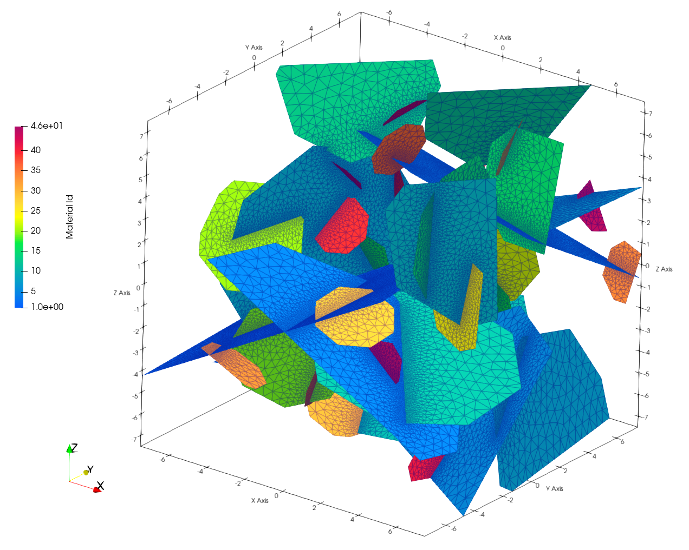
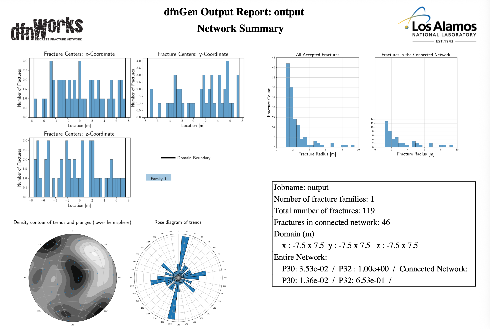
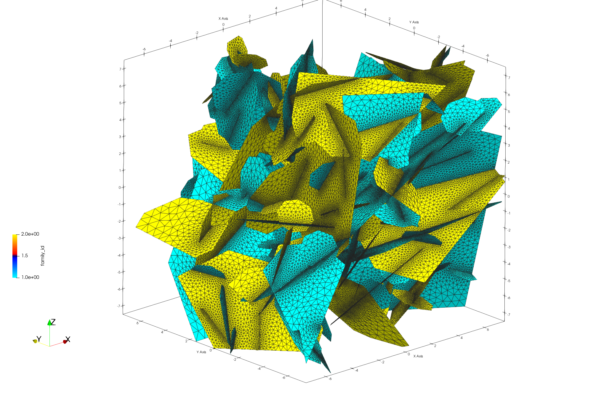

dfnWorks Tutorial for TPL (Truncated Power-Law) 
================================================


.. figure:: figures/tpl_3images.png
   :scale: 100 %
   :alt: alternate text
   :align: center


The TPL (Truncated Power-Law) is a type of distribution ('tpl', 'log_normal', 'exp', or 'constant') that defines the sample distribution for the fracture radius.

This example consists of one family of fractures whose sizes have a truncated power law distribution with a minimum radius of 1 meter and a maximum size of 10 meters.  

For a complete list of parameters and functions see [pydfnworks: dfnGen](https://lanl.github.io/dfnWorks/pydfnGen.html)


The following items are covered in this Tutorial:

.. contents::
   :depth: 2
   :local:


Tutorial Prerequisites
--------------------------

- For this Tutorial you do not need to run dfnWorks. You can read through the steps for a basic understanding of the work flow. Images and output examples are included with this tutorial.
- This Tutorial assumes you are familiar with the basics of running dfnWorks.  These basics are covered in the Tutorial  [Introduction and Beginner Tutorial](https://lanl.github.io/dfnWorks/tutorial_intro.html) 
For install and setup instuctions, refer to the section at :ref:`pydfnWorks install <pydfnworks-setup>`.
- TeX Live is needed to write the PDF report summary. Local servers use ```module load texlive```
- Paraview_ is an open-source visualization software and is used to create the mesh and simulation images in this document.  Instructions for downloading and installing Paraview_ can be found at http://www.paraview.org/download/ 


dfnWorks TPL Overview
--------------------------

The TPL option for stochastic generation of fractures... brief overview.




This tutorial's main focus will be dfnGen and how to use TPL parameters to generate a network. Evaluations include visualization of the fractures and reports generated by dfnWorks. 


Python add_fracture_family
---------------------------

Open the script python `driver.py`. You can open with any text editor or use the unix command ``cat driver.py`` which will display the content to the screen.  Note the first line of the file imports the `pydfnworks` package. This allows the user to run dfnWorks from the command line and call dfnWorks within other python scripts.

Single family network
alpha is the TPL parameter
kappa concentration param of the von Mises-Fisher distribution
beta angle rotation around fracture axis
spherical theta for Z and phi for XY plane

For more details on these parameters, please refer to the `TPL_parameters.txt <TPL_parameters.txt>`_ file for the necessary settings.


.. code-block:: bash

    DFN.add_fracture_family(
        shape="ell",
        distribution="tpl",
        alpha=1.8,
        min_radius=1.0,
        max_radius=10.0,
        kappa=1.0,
        theta=0.0,
        phi=0.0,
        #aspect=2,
        p32=1,
        hy_variable='aperture',
        hy_function='correlated',
        number_of_points=8,
        hy_params={
            "alpha": 10**-5,
            "beta": 0.5
        })


Network Evaluations
--------------------------

The most immediate feedback for the network are text reports.
Additional information is provided in statistical reports.
Visual inspection provides best sense of the network.


.. code-block:: bash

    DFN.check_input()
    DFN.create_network()
    DFN.output_report()
    DFN.mesh_network(min_dist=1, max_dist=5, max_resolution_factor=10)


Log Reports
~~~~~~~~~~~~~~~~~~~

See output.log

While dfnWorks is running, you will see extensive reporting to the screen. This will alert you to errors or missing files. When finished, a report is written to to file `output.log`. This is the first place to check if there are any issues. Look for the first occurrence of Errors as later Errors are likely caused by the first. Warnings may exist and can usually be ignored.

The directory `/output` is created and contains files written during the run. Many of the files were created as input for the meshing and simulation portions of the workflow. These files can be helpful in understanding the run and for viewing the mesh and fractures used.

A list of dfnWorks files and their descriptions are at :ref:`dfnWorks Files <output-chapter>`.


Statistical Reports
~~~~~~~~~~~~~~~~~~~~

Created by DFN.output_report()
see output_output_report.pdf  and directory dfnGen_output_report

utput_report(self, verbose=True, output_dir='dfnGen_output_report')[source]

    Creates a PDF output report for the network created by DFNGen. Plots of the fracture lengths, locations, orientations are produced for each family. Files are written into “output_dir/family_{id}/”. Information about the whole network are also created and written into “output_dir/network/”

    Parameters:

            self (object) – DFN Class object

            verbose (bool) – Toggle for the amount of information printed to screen. If true, progress information printed to screen

            output_dir (string) – Name of directory where all plots are saved

    Return type:

        None

    Notes

    Final output report is named “jobname”_output_report.pdf User defined fractures (ellipses, rectangles, and polygons) are not supported at this time.





   *dfnWorks routine DFN.output_report() will generate a PDF summary of the network.*


Visual Inspection
~~~~~~~~~~~~~~~~~~~

Created by DFN.mesh_network()
Meshed network to be used by simulations.
See full_mesh.inp or reduced_mesh.inp

View the mesh attributes to check parameters. 
Materials are the fractures generated 1 through n.
Property evol_one are the element volumes
Property dfield is the linear distance from intersections and is used for element size changes.


.. raw:: html

    <div style="display: flex; justify-content: space-between;">

        <div style="flex: 1;">
            
        </div>

        <div style="flex: 1;">
            
        </div>

        <div style="flex: 1;">
            
        </div>

    </div>


You can adjust color maps and opacity for views that help show the meshed network.
See examples in file `tpl_paraview_examples.rst <tpl_paraview_examples.rst>`_ 


Run Flow Model
---------------

The pydfnworks commands `dfn_flow()` and `dfn_trans()` are used to run the simulations. These can provide insights into the behavior of fluids within the fractured network.

View the dfnFlow_file 'file.in'. This is a PFLOTRAN input file.  EDIT TEXT High pressure (red) Dirichlet boundary conditions are applied on the edge of the single fracture along the boundary x = -0.5, and low pressure (blue) boundary conditions are applied on the edges of the two fractures at the boundary x = 0.5. 

The solver type is set to PFLOTRAN

For viewing results see the vtk files written in output/parsed_vtk

Read dfn_explicit-000.vtk see permeability and Liquid Pressure at time 0
Read dfn_explicit-001.vtk for Liquid Pressure at time 1


.. raw:: html

    <div style="display: flex; justify-content: space-between;">

        <div style="flex: 1;">
            
        </div>

        <div style="flex: 1;">
            
        </div>

        <div style="flex: 1;">
            
        </div>

    </div>


Run Transport Model
--------------------

View the dfnTrans_file 'file.dat.  EDIT TEXT Particles are inserted SOMEWHERE 
to exit SOMEWHERE else

Generate particle tracks with call....

NOTE: There are a thousand particle tracks, these can be merged into a single file "all_particles.inp" with the command 

.. raw:: html

    <div style="display: flex; justify-content: space-between;">

        <div style="flex: 1;">
            
        </div>

        <div style="flex: 1;">
            
        </div>

        <div style="flex: 1;">
            
        </div>

    </div>


Add a Second family
---------------------

Once this network is working well, a more complicated version can be created by adding more families with different paramters from the first.





Conclusion EDIT this
------------------------------------------

You have successfully run dfnWorks to create a simple fracture network and run  basic simulations using the `driver.py` script in dfnWorks! As you become more familiar with the setup, you can start experimenting with different fracture characteristics, domain sizes, and simulation parameters to further explore subsurface flow dynamics in fractured media.


Additional Resources EDIT these
------------------------------------------

There are more demo runs in the `dfnWorks/examples` directory.  The first two examples are simpler than the last three so it is recommended that the user proceed in the order presented here. 

• 4_user_rects (4_user_defined_rectangles): The example used in this tutorial. 
• 4_user_ell_uniform (4_user_defined_ellipses): User defined elliptical fractures.
• exp (exponential_dist): Use parameters for two families of fractures with an exponential distribution of fracture size.
• lognormal (lognormal_dist): Use parameters for two families of fractures with a lognormal distribution of fracture size.
• TPL (truncated_power_law_dist): Use parameters for two families of fractures with a truncated power-law distribution of fracture size.

See a description of these 5 examples at :ref:`pydfnWorks examples <examples>`.

All examples are available from github at `DFNWorks Examples <https://github.com/lanl/dfnWorks/tree/master/examples>`_

For a short description of all examples see `Examples README file <https://github.com/lanl/dfnWorks/tree/master/examples/README.md>`_

For Additional Resources you can browse the online docs including examples, module descriptions, and the pydfnworks code descriptions.
The Publications are a good source of applications and discussions. Consider joining community forums and user groups for support and to share experiences with dfnWorks users.

Feel free to reach out if you have any questions or need further assistance with your simulation!


