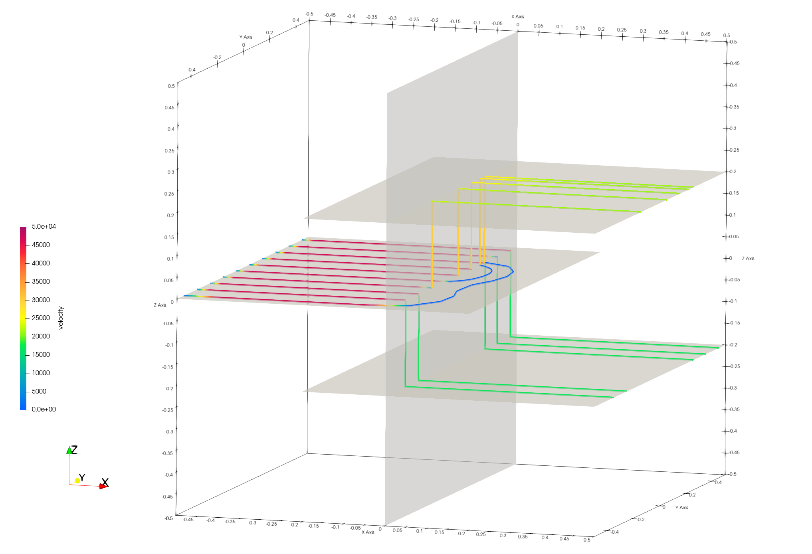

dfnWorks Introduction and Beginner Tutorial
==============================================

This tutorial serves as an introduction to dfnWorks for new users. It covers the example 4_user_rect, providing a detailed explanation and running instructions. All images are rendered using ParaView, which can be downloaded for free at www.paraview.org. By the end of this tutorial, users should feel confident running additional examples and applying them to their own projects. 

You can run dfnWorks using Docker or build it on your own machine. For initial runs, we recommend using Docker, as it simplifies the setup process before committing time to install the full suite. For more information, please refer to the Setup and Installation section in setup.rst. 

dfnWorks Package Overview
------------------------

.. figure:: figures/dfnworks_pdf_modules_copy.png
   :scale: 50 %
   :alt: alternate text
   :align: center

   *dfnWorks modules include dfnGen for meshing with dfnFlow and dfnTrans for simulations.*

dfnWorks is a parallelized computational suite to generate three-dimensional discrete fracture networks (DFN) and simulate flow and transport. To run a workflow using the dfnWorks suite, the python pydfnworks package is used. The package pydfnworks calls
various tools in the dfnWorks suite with the aim to provide a seamless workflow. 

There are 3 main modules in dfnWorks:

dfnGen 
~~~~~~~~~~~~~~~~~

dfnGen primarily involves two steps: FRAM (the feature rejection algorithm for meshing) and LaGriT, the meshing tool box used to create a conforming Delaunay triangulation of the network.

-	FRAM (feature rejection algorithm for meshing) is executed using the dfnGen C++ source code, contained in the dfnGen folder of the dfnWorks repository.
-	The LaGriT meshing toolbox is used to create a high resolution computational mesh representation of the DFN. An algorithm for conforming Delaunay triangulation is implemented so that fracture intersections are coincident with triangle edges in the mesh and Voronoi control volumes are suitable for finite volume flow solvers such as FEHM and PFLOTRAN.

See the docs at :ref:`pydfnWorks: dfnGen <dfngen-chapter>`

dfnFlow 
~~~~~~~~~~~~~~~~~~~~

Setup files and workflow include the use of PFLOTRAN or FEHM to solve for flow using the mesh files from LaGriT.

-	PFLOTRAN is a massively parallel subsurface flow and reactive transport code. PFLOTRAN solves a system of partial differential equations for multiphase, multicomponent and multiscale reactive flow and transport in porous media. 
- FEHM is a subsurface multiphase flow code developed at Los Alamos National Laboratory.

See the docs at :ref:`pydfnWorks: dfnFlow <dfnflow-chapter>`

dfnTrans 
~~~~~~~~~~~~~~~~~~~~~

dfnTrans is a method for resolving solute transport using control volume flow solutions obtained from dfnFlow on the unstructured mesh generated using dfnGen. We adopt a Lagrangian approach and represent a non-reactive conservative solute as a collection of indivisible passive tracer particles.

See the docs at :ref:`pydfnWorks: dfnTrans <dfntrans-chapter>`

dfnWorks Tutorial
=================

There are many dfnWorks projects in dfnWorks/examples, this tutorial will use dfnWorks/examples/4_user_rects.

This test case consists of four user defined rectangular fractures within a a cubic domain with sides of length one meter. After running dfnWorks you will view the fracture mesh, the fractures colored by pressure, and the particle tracks as shown in the image. 

.. figure:: figures/4_user_rectangles.png
   :height: 400px 
   :alt: alternate text
   :align: center
	
   *The meshed network of four rectangular fractures with views of the mesh, pressure on surfaces, and some particle tracks.*

dfnWorks is run in a terminal where you will interact with the system using text commands. The command line requires you to type commands and manage files directly, so it can be a bit more challenging initially. However, once you get familiar with the command line, it can offer greater flexibility and automation capabilities, especially for running batch processes or integrating scripts into larger workflows.

This guide will help beginners understand the essential steps involved in setting up and executing dfnWorks. 

Tutorial Prerequisites
------------------------------------

- Docker dfnWorks is recommended for new users.
- If you are not using Docker, Ensure that you have Python and the PyDFNworks package installed in your environment.
- Download a clone of the dfnWorks repository for this example and others 
- Paraview is used to create images and you may want to use it (or Visit) to view files.

Step 1. Navigate to Example Directory
------------------------------------------

From the top of dfnWorks repository, use the `cd` command to move to the folder where input files and driver.py are located. 

.. code-block:: bash

    cd examples/4_user_rects

Familiarize yourself with the structure of your project directory and the expected input files.

-	driver.py is the python script controlling the files and the workflow.
-	dfn_explicit.in is PFLOTRAN control file
-	PTDFN_control.dat is the FEHM control file for particle tracking

Step 2. Execute the `driver.py` script 
------------------------------------------

In the terminal, execute the script using Python.

.. code-block:: bash

    python driver.py

If you are running files within Docker with dfnWorks (no mounted volume):

.. code-block:: bash

    docker pull ees16/dfnworks:latest
    docker run -ti ees16/dfnworks:latest
    python driver.py

If you are running with Docker dfnWorks with the cloned repository as your mounted volume:

.. code-block:: bash

    docker pull ees16/dfnworks:latest
    docker run -v "$(pwd):/app" -w /app ees16/dfnworks:latest python driver.py

While dfnWorks is running, you will see extensive reporting to the screen. This will alert you of errors or missing files. When done a report file is written to `output.log`. This is the first place to check if there were any issues. Look for the first occurrence of Errors as fixing those will likely fix the ones that follow. Warnings can usually be ignored but may be helpful.

The new directory `/output` contains files written during the run. Many of the files were created as input for the meshing and simulation portions of the workflow. These files can be helpful in understanding the run and for viewing the mesh and fractures used.

Output and results are discussed in the following sections.

Step 3. Understanding the Script 
------------------------------------------

Open the script python `driver.py`. You can open with any text editor or use the unix command ``cat driver.py`` which will display the content to the screen.

Initialization
~~~~~~~~~~~~~~~~~~~~~

    The script begins by importing the necessary libraries and setting up paths for input files and the output directory. 

        - It creates a DFNWORKS object, specifying paths for the flow and transport control files. 
        - It prepares the output environment using make_working_directory(delete=True), which ensures a fresh directory for storing results. 

Define Parameters
~~~~~~~~~~~~~~~~~~~~~

    The domain size and hydraulic head are defined. This defines domain to a cube of size 1 unit in all dimensions and sets h (hydraulic head of fluid in domain) to 0.1 unit.

.. code-block:: python

    DFN.params['domainSize']['value'] = [1.0, 1.0, 1.0] 
    DFN.params['h']['value'] = 0.1  

Adding Fractures
~~~~~~~~~~~~~~~~~~~

    The script uses `add_user_fract` methods to create rectangular-shaped fractures with specified properties such as radius, translation, normal vector, and permeability. Four fractures are created in this example.

    Key fracture parameters include: 
    - Shape : The geometric shape of the fracture (e.g., 'rect' for rectangular). 
    - Radii : The size or extent of the fracture. 
    - Aspect Ratio : The ratio of the length to width for non-circular fractures. 
    - Translation : The position of the fracture in the domain. 
    - Normal Vector : This represents the orientation of the fracture. 
    - Permeability : Describes how easily fluids can pass through the fracture. 

For this fracture, the shape is rectangle, with radii less than the length of the domain of 1. The normal is in the Z direction and translated -.4 units. The other horizontal fractures are translated above and below 0 and in the positive x direction. The center vertical fracture has radii 1, same as the domain width. 

.. code-block:: python

    DFN.add_user_fract(shape='rect',
        radii=0.6,
        translation=[-0.4, 0, 0],
        normal_vector=[0, 0, 1],
        permeability=1.0e-12)  # Fracture properties defined

.. figure:: figures/tut1_polys_setup.png
   :scale: 50 %
   :alt: fracture setup 
   :align: center

   *fractures in order of definitions 1 (blue), 2 (green vertical), 3 (orange top), and 4 (red bottom).*

   This image was created with Paraview reading the AVS mesh file output/full_mesh.inp. The fractures are colored by Material ID as assigned by dfnGen module. 

Network Creation
~~~~~~~~~~~~~~~~~~~

    The script checks if the inputs are correct and prints the parameters of the domain for verification.  If everything checks ok, the `create_network()` method generates the fracture network based on the defined parameters.

    Note you can stop driver.py after `create_network()` but before calling the simulations.

    Observe output, all tests should output "Test passed". Any tests which ouput "TEST FAILED" must be debugged.

    Debug Tips:
        Enable full mesh by setting "visualizationMode: 0" in the tests corresponding python script.
        View the program output.txt file in the folder.

.. figure:: figures/tut1_mesh_lines.png
   :scale: 50 %
   :alt: fracture mesh 
   :align: center

   *dfnWorks modules include dfnGen for meshing with dfnFlow and dfnTrans for simulations.*

.. figure:: figures/tut1_mesh_no_poly2.png
   :scale: 50 %
   :alt: fracture intersections 
   :align: center

   *dfnWorks modules include dfnGen for meshing with dfnFlow and dfnTrans for simulations.*

Running Simulations  
~~~~~~~~~~~~~~~~~~~

    Finally, the script executes flow and transport simulations using dfn_flow() and dfn_trans(), which provide insights into the behavior of fluids within the fractured network. 

    High pressure (red) Dirichlet boundary conditions are applied on the edge of the single fracture along the boundary x = -0.5, and low pressure (blue) boundary conditions are applied on the edges of the two fractures at the boundary x = 0.5. This image is created by loading the file 4_user_defined_rectangles/PFLOTRAN/parsed_vtk/dfn_explicit-001.vtk into Paraview.

    Particles are inserted uniformly along the inlet fracture on the left side of the image. Particles exit the domain through the two horizontal fractures on the right side of the image. Due to the stochastic nature of the particle tracking algorithm, your pathlines might not be exactly the same as in this image. Trajectories are colored by the current velocity magnitude of the particle’s velocity. Trajectories can be visualized by loading the files part_*.inp, in the folder 4_user_rectangles/dfnTrans/trajectories/ We have used the extract surface and tube filters in paraview for visual clarity.

Step 4. Verify the Fracture Network 
------------------------------------------

Upon completion of the script, output files will be created in the specified `output` directory. Review these files to analyze your DFN simulation results. See full description of files at files.rst

After generation, verify the mesh quality using the mesh quality tools available in the interface. Look for warnings or errors that may indicate issues with element quality or aspect ratios.

.. figure:: figures/tut1_mesh_lines.png
   :scale: 50 %
   :alt: fracture mesh
   :align: center

   *dfnWorks modules include dfnGen for meshing with dfnFlow and dfnTrans for simulations.*

.. figure:: figures/tut1_mesh_no_poly2.png
   :scale: 50 %
   :alt: fracture intersections
   :align: center

   *dfnWorks modules include dfnGen for meshing with dfnFlow and dfnTrans for simulations.*

Step 5. Analyze Simulation Results 
------------------------------------------

 High pressure (red) Dirichlet boundary conditions are applied on the edge of the single fracture along the boundary x = -0.5, and low pressure (blue) boundary conditions are applied on the edges of the two fractures at the boundary x = 0.5. This image is created by loading the file 4_user_defined_rectangles/PFLOTRAN/parsed_vtk/dfn_explicit-001.vtk into Paraview.

.. figure:: figures/tut1_liq_pressure_002.png
   :scale: 50 %
   :alt: fracture pressure
   :align: center

   *dfnWorks modules include dfnGen for meshing with dfnFlow and dfnTrans for simulations.*

Particles are inserted uniformly along the inlet fracture on the left side of the image. Particles exit the domain through the two horizontal fractures on the right side of the image. Due to the stochastic nature of the particle tracking algorithm, your pathlines might not be exactly the same as in this image. Trajectories are colored by the current velocity magnitude of the particle’s velocity. Trajectories can be visualized by loading the files part_*.inp, in the folder 4_user_rectangles/dfnTrans/trajectories/ We have used the extract surface and tube filters in paraview for visual clarity.

.. figure:: figures/tut1_parts_fracture.png
   :scale: 50 %
   :alt: fracture intersections
   :align: center

   *dfnWorks modules include dfnGen for meshing with dfnFlow and dfnTrans for simulations.*

   *dfnWorks modules include dfnGen for meshing with dfnFlow and dfnTrans for simulations.*

Conclusion
------------------------------------------

You have successfully run a basic simulation using the `driver.py` script in dfnWorks! As you become more familiar with the setup, you can start experimenting with different fracture characteristics, domain sizes, and simulation parameters to further explore subsurface flow dynamics in fractured media.

Additional Resources
------------------------------------------

- Consult the [dfnWorks documentation](https://github.com/DFNWorks) for detailed descriptions of parameters and functionality.
- Join community forums or user groups for support and to share experiences with dfnWorks users. 

Feel free to reach out if you have any questions or need further assistance with your simulation!

