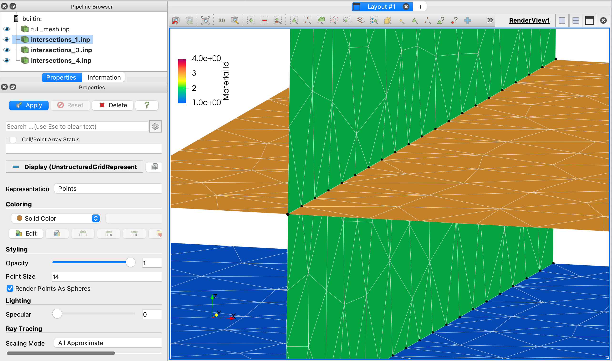

dfnWorks Introduction and Beginner Tutorial
==============================================

This tutorial serves as an introduction to dfnWorks for new users. It covers the example 4_user_rect, providing a detailed explanation and running instructions. By the end of this tutorial, you should feel confident running additional examples and applying them to your own projects. 

The following items are covered in this Tutorial:

.. contents::
   :depth: 2
   :local:

Tutorial Prerequisites
--------------------------

For this Tutorial you do not need to run dfnWorks. You can read through the steps for a basic understanding of the work flow. Images and output examples are included on this page.

You will learn more if you follow the tutorial with your own version of dfnWorks. You can run dfnWorks using Docker or build dfnWorks on your own machine. For initial runs, we recommend using Docker, as it simplifies the setup process before committing time to install the full suite. 

For more information, please refer to the Setup and Installation section at :ref:`pydfnWorks install <pydfnworks-setup>`.
 
If you are not using the files in the Docker container, but want to run this example, you will need to download a clone of the dfnWorks repository:

.. code-block:: bash

    $ git clone https://github.com/lanl/dfnWorks.git

Paraview_ is an open-source visualization software and is used to create the mesh and simulation images in this document. 
Instructions for downloading and installing Paraview_ can be found at http://www.paraview.org/download/ 

.. _Paraview: http://www.paraview.org

dfnWorks Package Overview
--------------------------

.. figure:: figures/dfnworks_pdf_modules_copy.png
   :scale: 50 % 
   :alt: alternate text
   :align: center

   *dfnWorks modules include dfnGen for meshing with dfnFlow and dfnTrans for simulations.*

dfnWorks is a parallelized computational suite to generate three-dimensional discrete fracture networks (DFN) and simulate flow and transport. To run a workflow using the dfnWorks suite, the python pydfnworks package is used. The package pydfnworks calls
various tools in the dfnWorks suite with the aim to provide a seamless workflow. 

There are 3 main modules in dfnWorks:

dfnGen 
~~~~~~~~~~~~~~~~~

dfnGen primarily involves two steps: FRAM (the feature rejection algorithm for meshing) and LaGriT, the meshing tool box used to create a conforming Delaunay triangulation of the network.

-	FRAM (feature rejection algorithm for meshing) is executed using the dfnGen C++ source code, contained in the dfnGen folder of the dfnWorks repository.
-	The LaGriT meshing toolbox is used to create a high resolution computational mesh representation of the DFN. An algorithm for conforming Delaunay triangulation is implemented so that fracture intersections are coincident with triangle edges in the mesh and Voronoi control volumes are suitable for finite volume flow solvers such as FEHM and PFLOTRAN.

See Module at :ref:`dfnGen <dfngen-chapter>` and python docs at :ref:`pydfnWorks: dfnGen <dfnWorks-python-chapter-dfnGen>`

dfnFlow 
~~~~~~~~~~~~~~~~~~~~

Setup files and workflow include the use of PFLOTRAN or FEHM to solve for flow using the mesh files from LaGriT.

-	PFLOTRAN is a massively parallel subsurface flow and reactive transport code. PFLOTRAN solves a system of partial differential equations for multiphase, multicomponent and multiscale reactive flow and transport in porous media. 
- FEHM is a subsurface multiphase flow code developed at Los Alamos National Laboratory.

See Module at :ref:`dfnFlow <dfnflow-chapter>` and python docs at :ref:`pydfnWorks: dfnFlow <dfnWorks-python-chapter-dfnFlow>`

dfnTrans 
~~~~~~~~~~~~~~~~~~~~~

dfnTrans is a method for resolving solute transport using control volume flow solutions obtained from dfnFlow on the unstructured mesh generated using dfnGen. We adopt a Lagrangian approach and represent a non-reactive conservative solute as a collection of indivisible passive tracer particles.

See Module at :ref:`dfnTrans <dfntrans-chapter>` and python docs at :ref:`pydfnTrans: dfnGen <dfnWorks-python-chapter-dfnTrans>`

Beginner Tutorial with 4_user_rects 
---------------------------------------

dfnWorks is run in a terminal where you will interact with the system using text commands. The command line requires you to type commands and manage files directly, so it can be a bit more challenging initially. However, once you get familiar with the command line, it can offer greater flexibility and automation capabilities, especially for running batch processes or integrating scripts into larger workflows.

This example, 4_user_rects, consists of four user defined rectangular fractures within a a cubic domain with sides of length one meter. 
High and low pressure boundary conditions are applied to the fracture mesh and used in ``dfnFlow``. 
Then particles are inserted along an inlet fracture and used in ``dfnTrans``.
After running dfnWorks you will view the fracture mesh, the fractures colored by pressure, and the particle tracks as shown in this image. 

.. figure:: figures/4_user_rectangles.png
   :height: 350px 
   :alt: 3 views of 4_user_rect 
   :align: center
	
   *Figure shows 4_user_rect  meshed network of four fractures with views of the mesh (left), pressure (middle), and particle tracks (right).*

Step 1. Navigate to Example Directory
~~~~~~~~~~~~~~~~~~~~~~~~~~~~~~~~~~~~~~~~~~

From the top of dfnWorks repository, use the `cd` command to move to the folder where input files and driver.py are located. 

.. code-block:: bash

    cd examples/4_user_rects

Familiarize yourself with the structure of this project directory and the input files. Note the directory is empty except for three input files:

- `driver.py` is the python script controlling the files and the workflow.
- `dfn_explicit.in` is a PFLOTRAN control file.
- `PTDFN_control.dat` is the control file for particle tracking.

Step 2. Execute the `driver.py` script 
~~~~~~~~~~~~~~~~~~~~~~~~~~~~~~~~~~~~~~~~~~

In the terminal, execute the script using Python.

.. code-block:: bash

    python driver.py

If you are running files within Docker (no mounted volume):

.. code-block:: bash

    docker pull ees16/dfnworks:latest
    docker run -ti ees16/dfnworks:latest
    python driver.py

If you are running Docker with the dfnWorks repository as your mounted volume:

.. code-block:: bash

    docker pull ees16/dfnworks:latest
    docker run -v "$(pwd):/app" -w /app ees16/dfnworks:latest python driver.py

While dfnWorks is running, you will see extensive reporting to the screen. This will alert you to errors or missing files. When finished, a report is written to to file `output.log`. This is the first place to check if there are any issues. Look for the first occurrence of Errors as later Errors are likely caused by the first. Warnings may exist and can usually be ignored.

The directory `/output` is created and contains files written during the run. Many of the files were created as input for the meshing and simulation portions of the workflow. These files can be helpful in understanding the run and for viewing the mesh and fractures used.

A list of dfnWorks files and their descriptions are at :ref:`dfnWorks Files <output-chapter>`.

Step 3. Understanding the Script 
~~~~~~~~~~~~~~~~~~~~~~~~~~~~~~~~~~~~~~~~~~

Open the script python `driver.py`. You can open with any text editor or use the unix command ``cat driver.py`` which will display the content to the screen.  Note the first line of the file imports the `pydfnworks` package. This allows the user to run dfnWorks from the command line and call dfnWorks within other python scripts. 

You can also see a complete description of pydfnworks python package and example `driver.py` at :ref:`pydfnWorks python package <dfnWorks-python-chapter>`.

Script: Initialization
^^^^^^^^^^^^^^^^^^^^^^^^^^

The script begins by importing the necessary libraries and setting up paths for input files and the output directory. 

- It creates a DFN object, specifying paths for the flow and transport control files. 
- It prepares the output environment using make_working_directory(delete=True), which ensures a fresh directory for storing results. 

Script: Define Parameters
^^^^^^^^^^^^^^^^^^^^^^^^^^

The domain size and hydraulic head are defined for the DFN object. The domain is set to length 1 in all dimensions and h (hydraulic head of fluid in domain) is set to 0.1 unit.

.. code-block:: python

    DFN.params['domainSize']['value'] = [1.0, 1.0, 1.0] 
    DFN.params['h']['value'] = 0.1  

Script: Define Fractures
^^^^^^^^^^^^^^^^^^^^^^^^^^

The dfnGen module manages and creates the fracture network. Parameters can be set using fracture families (for generated fractures) or set individually by the user. See a full description of fracture parameters and commands at :ref:`pydfnWorks: dfnGen <dfngen-chapter>`. 

The script for this example uses `add_user_fract` commands to create rectangular-shaped fractures with specified properties such as radius, translation, normal vector, and permeability. Four fractures are created in this example.

Key fracture parameters include: 

- Shape : The geometric shape of the fracture (e.g., 'rect' for rectangular). 
- Radii : The size or extent of the fracture. 
- Aspect Ratio : The ratio of the length to width for non-circular fractures. 
- Translation : The position of the fracture in the domain. 
- Normal Vector : This represents the orientation of the fracture. 
- Permeability : Describes how easily fluids can pass through the fracture. 

For this example, four fractures are created. Their shape is rectangle, with radii less than the length of the domain of 1. Three fractures are horizontal with normal in positive Z direction and translated  by .4 in the X direction. One fracture is at Z=0, the other horizontal fractures are translated above and below the 0 elevation. The 2nd fracture defined is vertical with a radii of 1, equal to the domain width. 

.. code-block:: python

    DFN.add_user_fract(shape='rect',
        radii=0.6, translation=[-0.4, 0, 0], normal_vector=[0, 0, 1], permeability=1.0e-12)

    DFN.add_user_fract(shape='rect',
        radii=1.0, aspect_ratio=.65, translation=[0, 0, 0], normal_vector=[1, 0, 0], permeability=1.0e-12)

    DFN.add_user_fract(shape='rect',
        radii=.6, translation=[0.4, 0, 0.2], normal_vector=[0, 0, 1], permeability=2.0e-12)

    DFN.add_user_fract(shape='rect',
        radii=.6, translation=[0.4, 0, -0.2], normal_vector=[0, 0, 1], permeability=1.0e-12)

This image was created with Paraview reading the AVS mesh file output/full_mesh.inp. The fractures are colored by Material ID as assigned by dfnGen module. It is a good idea to create the fracture mesh and check it before running the simulations.  

.. figure:: figures/tut1_polys_setup.png
   :width: 500px  
   :alt: four fractures  
   :align: center

   *Figure shows fractures in order of definition; 1 (blue), 2 (green vertical), 3 (orange top), and 4 (red bottom).*

Script: Mesh the Fracture Network
^^^^^^^^^^^^^^^^^^^^^^^^^^^^^^^^^^^^

Once parameters and fractures have been defined, the script checks if the inputs are correct and prints the parameters of the domain for verification.  If everything checks ok, the `create_network()` method generates the fracture network based on the defined parameters.

It is recommended that you stop driver.py after `create_network()` but before calling the simulations. Ensure the mesh and all checks are good and as expected.  Observe output screen reports and the output log file and check for Errors or unexpected results, 

Checking the screen output or file `output.log`, the mesh reports look as expected:

.. code-block:: bash

    * Checking for meshing issues.
    Merging the mesh: Starting
    --> Writting partial merge scripts
    --> There are 2 fractures in each part
    --> Writting merge scripts: Complete
    --> Writing : merge_network.lgi
    --> Dumping output for PFLOTRAN
    --> Writing : merge_network.lgi - complete

    Opening full_mesh.inp
    Number of Nodes: 537
    Reading in Material ID: materialid.dat
    There are 4 Materials
    Reading in Apertures
    Reading in UGE: full_mesh.uge
    Number of Cells: 537
    --> Number of Connections: 1533
    --> new UGE written in full_mesh_vol_area.uge

The meshed fractures are written to the AVS format file `full_mesh.inp` with 4 materials, 537 nodes, and 537 cells. Setup files for the simulations are also written. These include voronoi areas (.stor and .uge) and boundaries (.zone and .ex).

 

Script: Run Simulations  
^^^^^^^^^^^^^^^^^^^^^^^^^^^^

The pydfnworks commands `dfn_flow()` and `dfn_trans()` are used to run the simulations. These can provide insights into the behavior of fluids within the fractured network.

View the dfnFlow_file 'dfn_explicit.in'. This is a PFLOTRAN input file.  High pressure (red) Dirichlet boundary conditions are applied on the edge of the single fracture along the boundary x = -0.5, and low pressure (blue) boundary conditions are applied on the edges of the two fractures at the boundary x = 0.5. 

The dfn_flow is successful:

.. code-block:: bash

     ==================================================
     --> Running PFLOTRAN
     --> Running: /dfnWorks/lib/petsc/arch-linux2-c-debug/bin/mpirun -np 4 /dfnWorks/bin/pflotran -pflotranin dfn_explicit.in
     ==================================================
     --> Running PFLOTRAN Complete
     ==================================================

View the dfnTrans_file 'PTDFN_control.dat.  Particles are inserted uniformly along the inlet fracture on the left side of the fracture network. Particles exit the domain through the two horizontal fractures on the right side of the domain. 

The dfn_trans run is successful:

.. code-block:: bash

     ==================================================
     dfnTrans Starting
     ==================================================
     --> Checking Initial Conditions
     --> Checking Initial Conditions Complete
     Executing /dfnWorks/bin/DFNTrans PTDFN_control.dat
     ==================================================
     dfnTrans Complete

Step 4. Verify the Fracture Mesh 
~~~~~~~~~~~~~~~~~~~~~~~~~~~~~~~~~~~~~~~~~~

Upon completion of the python script, output files will be created in the specified `output` directory. 
The primary file for viewing the fracture mesh is `full_mesh.inp` which includes mesh properties such as fracture (and family) IDs, materials, and permeability. Note all `*.inp` are AVS format files that can be viewed by Paraview. 

Viewing the the mesh and program output files will allow simple mistakes to be fixed.
Checking the output log file to screen and file `output.log`, the mesh reports look as expected:

.. code-block:: bash

     Meshing DFN using LaGriT : Starting
     ================================================================================
     --> Computing mesh resolution function
     --> Variable Mesh Resolution Selected
     *** Minimum distance [m] from intersection with constant resolution h/2 : 0.05
     *** Maximum distance [m] from intersection variable resolution : 1.0
     *** Upper bound on resolution [m] : 1.00

Additional output information and log files are written in the `output` directory. Checking the report in `output/dfngen_logfile.txt` the following information confirms the DFN mesh was created with no Errors. Note extra files are written to aid evaluations if needed.

.. code-block:: bash

    [2025-03-06 17:15:01] INFO: 4 Fractures Accepted (Before Isolated Fracture Removal)
    [2025-03-06 17:15:01] INFO: 4 Final Fractures (After Isolated Fracture Removal)
    [2025-03-06 17:15:01] INFO: /app/output/dfnGen_output
    [2025-03-06 17:15:01] INFO: Writing /app/output/dfnGen_output/../params.txt
    [2025-03-06 17:15:01] INFO: Writing Radii File (radii.dat)
    [2025-03-06 17:15:01] INFO: Writing Rejection Statistics File (rejections.dat)
    [2025-03-06 17:15:01] INFO: Writing Family Definitions File (families.dat)
    [2025-03-06 17:15:02] INFO: Writing Fracture Translations File (translations.dat)
    [2025-03-06 17:15:02] INFO: Writing Connectivity Data (connectivity.dat)
    [2025-03-06 17:15:02] INFO: Writing Rotation Data File (poly_info.dat)
    [2025-03-06 17:15:02] INFO: Writing Normal Vectors into File (normal_vectors.dat)
    [2025-03-06 17:15:02] INFO: Writing Rotation Data File (rejectsPerAttempt.dat)
    [2025-03-06 17:15:02] INFO: DFNGen - Complete

.. figure:: figures/tut1_mesh_lines.png
   :width: 600px 
   :alt: fracture mesh
   :align: center

   *Figure shows the meshed fractures colored by the fracture ID.*

It is important that fracture intersections are well connected. You can overlay the intersections on the full mesh for easier examination as shown in the image below. An AVS file is written for each and are found in `output/intersections/intersections_*.inp`

.. figure:: figures/tut1_intersections_close.png
   :width: 450px 
   :alt: fracture intersections
   :align: center

   *Figure shows close-up of intersection (black dots) created in the meshed fractures.*

The intersections can be represented as wire-frame or points. Selecting spherical points will make the connectivity between intersecting fractures more visible. Click on image for full size views.

   *Snapshot of Paraview session with intersections represented as spherical points.*

Step 5. Analyze Simulation Results 
~~~~~~~~~~~~~~~~~~~~~~~~~~~~~~~~~~~~~~~~~~

View the screen report or  `output.log` to verify the dfnFlow module has written result files.

.. code-block:: bash

    2025-03-06 17:15:04,156 INFO --> Running PFLOTRAN
    2025-03-06 17:15:04,924 INFO --> Processing file: dfn_explicit-000.vtk
    2025-03-06 17:15:04,933 INFO --> Processing file: dfn_explicit-001.vtk

Read the PFLOTRAN result file `output/parsed_vtk/dfn_explicit-001.vtk` into Paraview and select the property pressure to view.
High pressure (red) is shown on the edge of the single fracture along the boundary x = -0.5, and low pressure (blue) boundary conditions are applied on the edges of the two fractures at the boundary x = 0.5.

.. figure:: figures/tut1_liq_pressure_002.png
   :width: 600px 
   :alt: fracture pressure
   :align: center

   *Figure shows the fracture surfaces colored by Liquid_Pressure*

If you do not see file names for dfn_Trans results, look for a `traj` or `trajectories`. In this example particle files are written to `output/traj/trajectories/part_1.inp, ... part_10.inp`.

Use Paraview to read full_mesh.inp and all the particle files.  For the particle lines, select "wireframe" and expand the line width for easier views. The lines in the image below are colored by the fracture ID, also view velocity for good views.

View shows particles uniform along the inlet fracture on the left side of the image. Particles exit the domain through the two horizontal fractures on the right side of the image. Due to the stochastic nature of the particle tracking algorithm, your pathlines might not be exactly the same as in this image. 

   *Figure shows the fracture surfaces with  particle lines colored by the fracture ID.*

Conclusion
------------------------------------------

You have successfully run dfnWorks to create a simple fracture network and run  basic simulations using the `driver.py` script in dfnWorks! As you become more familiar with the setup, you can start experimenting with different fracture characteristics, domain sizes, and simulation parameters to further explore subsurface flow dynamics in fractured media.

Additional Resources
------------------------------------------

There are more demo runs in the `dfnWorks/examples` directory.  The first two examples are simpler than the last three so it is recommended that the user proceed in the order presented here. 

• 4_user_rects (4_user_defined_rectangles): The example used in this tutorial. 
• 4_user_ell_uniform (4_user_defined_ellipses): User defined elliptical fractures.
• exp (exponential_dist): Use parameters for two families of fractures with an exponential distribution of fracture size.
• lognormal (lognormal_dist): Use parameters for two families of fractures with a lognormal distribution of fracture size.
• TPL (truncated_power_law_dist): Use parameters for two families of fractures with a truncated power-law distribution of fracture size.

See a description of these 5 examples at :ref:`pydfnWorks examples <examples>`.

All examples are available from github at `DFNWorks Examples <https://github.com/lanl/dfnWorks/tree/master/examples>`_

For a short description of all examples see `Examples README file <https://github.com/lanl/dfnWorks/tree/master/examples/README.md>`_

For Additional Resources you can browse the online docs including examples, module descriptions, and the pydfnworks code descriptions.
The Publications are a good source of applications and discussions. Consider joining community forums and user groups for support and to share experiences with dfnWorks users.

Feel free to reach out if you have any questions or need further assistance with your simulation!

