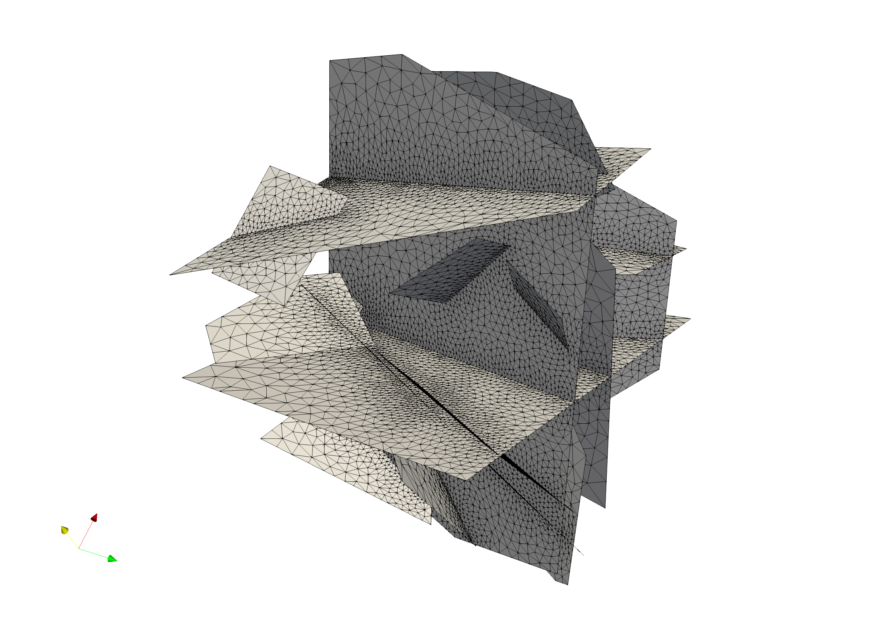
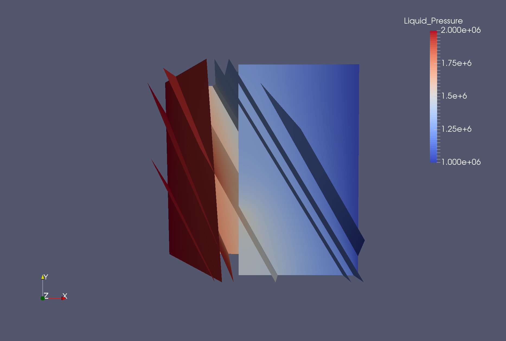

Tutorial
=============================

This document contains a short, five example, tutorial for dfnWorks. The five test cases provided are for:

- 4_user_defined_rectangles: The user defines the precise location and size of four rectangular fractures.
- 4_user_defined_ellipses: The user defines the precise location and size of four elliptical fractures, where the ellipses are approximated as polygons.
- exponential_dist: The user specifies the parameters for two families of fractures with an exponential distribution of fracture size.
- lognormal_dist: The user specifies the parameters for two families of fractures with a lognormal distribution of fracture size.
- truncated_power_law_dist: The user specifies the parameters for two families of fractures with a truncated power-law distribution of fracture size. 

All required input files for these examples are contained in the folder dfnWorks-Version2.0/tests/. The focus of this document is to provide visual confirmation that new users of dfnWorks have the code set up correctly, can carry out the following runs and reproduce the following images. All images are rendered using Paraview, which can be obtained for free at http : //www.paraview.org/. The first two examples are simpler than the last three so it is recommended that the user proceed in the order presented here. 

Turn on X forwarding if on server
----------------------------------

Ensure that X forwarding is turned on if you are running dfnWorks from an ssh connection. This requires that the ssh login have the -X option:

.. code-block:: bash
   
    $ ssh -X SERVER_NAME 

Go to the dnfWorks-Version2.0 repository
------------------------------------------

.. code-block:: bash

    $ cd ~/dfnWorks-Version2.0/

Fix paths in test directory 
----------------------------

Fix the pathnames for all files in the folder /tests/ . This can be done automatically by running the script fix_paths.py:

.. code-block:: bash

    $ cd /pydfnworks/bin/
    $ python fix_paths.py 

Set the PETSC, PFLOTRAN, Python, and LaGriT paths correctly
----------------------------------------------------------------

**Before executing dfnWorks,** the following paths must be set:

- DFNWORKS_PATH: the dfnWorks-Version2.0 repository folder
- PETSC_DIR and PETSC_ARCH: PETSC environmental variables
- PFLOTRAN_DIR: The PFLOTRAN directory
- python_dfn: The location of the Python distribution to use
- lagrit_dfn: The location of the LaGriT executable

.. code-block:: bash
    
    $ vi /pydfnworks/pydfnworks/paths.py

For example:

.. code-block:: python
    
    os.environ['DFNWORKS_PATH'] = '/home/nknapp/dfnWorks-Version2.0/'    

Setup the Python package pydfnworks
-------------------------------------

Go up a directory:

.. code-block:: bash
    
    $ cd ..

**If the user has admin privelges**:

.. code-block:: bash
    
    $ python setup.py install

**If the user DOES NOT have admin priveleges**:

.. code-block:: bash
   
    $ python setup.py install --user

Executing dfnWorks
-------------------

To run one of the test cases enter the following command:

- python run.py -name [JOBNAME] -input [INPUT_FILE] -ncpu [NUMBER_OF_CPUS]  

The arguments are:

- [JOBNAME]: The name of the run, which is also the absolute path name of the folder which will contain the run's output.
- [INPUT_FILE]: An input file with three lines that have input files for dfnGen, dfnFlow, and dfnTrans, respectively. Any of the files with ending .txt in the directory tests can be used as examples of input files. 
- [NUMBER_OF_CPUS]: The number of CPUs that the user would like to use for the parralel computation of the meshing and flow solutions.

For example, to run the 4_user_defined rectangles test below, on 4 CPUs,  the command line input would be:

.. code-block:: bash
    
    $ cd bin    
    $ python run.py -name /home/nknapp/4_user_defined_rectangles
     -input /home/nknapp/dfnWorks-Version2.0/tests/4_user_defined_rectangles.txt
     -ncpu 4  

This command will run the 4_user_defined_rectangles test and create a new folder 4_user_defined_rectangles where all output files will be located. Descriptions of each output file are in the documentation. In the following sections, we provide descriptions of the output you should expect for each of the five examples.

Summary
--------

Here is a quick summary of the steps described above, with commands for the 4_user_defined_rectangles test case. **You MUST edit the paths in paths.py, and change ~ to the location of the repository, for these commands to work! Also, note that the last command should be on one line.** 

.. code-block:: bash
    
    $ ssh -X SERVER_NAME
    $ cd ~/dfnWorks-Version2.0/pydfnworks/bin/
    $ python fix_paths.py  
    $ vi /pydfnworks/pydfnworks/paths.py
    $ cd .. 
    $ python setup.py install --user
    $ cd bin    
    $ python run.py -name /home/nknapp/4_user_defined_rectangles
     -input /home/nknapp/dfnWorks-Version2.0/tests/4_user_defined_rectangles.txt
     -ncpu 4  

4_user_defined_rectangles
--------------------------

This test case consists of four user defined rectangular fractures within a a cubic domain with sides of length one meter. The input file specifiying the ellipses is in dfnWorks-Version2.0/tests, and is named define_4_user_rectangles.dat. To run the test on 4 cpus, enter the following command line input:

The network of four fractures, each colored by material ID. The computational mesh is overlaid on the fractures. This image is created by loading the file full_mesh.inp. located in the folder 4_user_defined_rectangles/LaGriT/, into Paraview.

.. image:: figures/4_user_rectangles_mesh.png
   :scale: 100 %
   :alt: alternate text
   :align: center
	
The network of four fractures,  colored by pressure solution.  
High pressure (red) Dirichlet boundary conditions are applied on the edge of the single fracture along the boundary x = -0.5, and low pressure (blue) boundary conditions are applied on the edges of the two fractures at the boundary x = 0.5.
This image is created by loading the file 4_user_defined_rectangles/PFLOTRAN/parsed_vtk/dfn_explicit-001.vtk into Paraview.

.. image:: figures/4_user_rectangles_pressure.png
   :scale: 100 %
   :alt: alternate text
   :align: center

Particle trajectories on the network of four fractures.   
Particles are inserted uniformly along the inlet fracture on the left side of the image. 
Particles exit the domain through the two horizontal fractures on the right side of the image.  
Due to the stochastic nature of the particle tracking algorithm, your pathlines might not be exactly the same as in this image. 
Trajectories are colored by the current velocity magnitude of the particle's velocity. 
Trajectories can be visualized by loading the files part\_*.inp, in the folder 4_user_rectangles/dfnTrans/trajectories/
We have used the extract surface and tube filters in paraview for visual clarity. 

.. image:: figures/4_user_rectangles_trace.png
   :scale: 100 %
   :alt: alternate text
   :align: center

In the other tests, only a brief description and pictures are provided. 

4_user_defined_ellipses
--------------------------

This test case consists of four user defined elliptical fractures within a a cubic domain with sides of length one meter. In this case the ellipses are approximated using 5 vertices. The input file specifiying the ellipses is in dfnWorks-Version2.0/tests, and is named define_4_user_ellipses.dat. 

.. image:: figures/4_user_ellipses_mesh.png
   :scale: 100 %
   :alt: alternate text
   :align: center

|
|

.. image:: figures/4_user_ellipses_pressure.png
   :scale: 100 %
   :alt: alternate text
   :align: center

|
|

.. image:: figures/4_user_ellipses_trace.png
   :scale: 100 %
   :alt: alternate text
   :align: center

|
|

truncated_power_law_dist
-------------------------

This test case consists of two families whose sizes have a truncated power law distribution with a minimum size of 0.5m and a maximum size of 50m. The domain size is cubic with an edge length of 4m. The other input parameters can be found in tests/gen_truncated_power_law_dist.dat.

.. image:: figures/power_mesh.png
   :scale: 100 %
   :alt: alternate text
   :align: center

|
|

.. image:: figures/power_pressure.png
   :scale: 100 %
   :alt: alternate text
   :align: center

|
|

.. image:: figures/power_trace.png
   :scale: 100 %
   :alt: alternate text
   :align: center

exponential_dist
------------------

This test case consists of a family of fractures whose size is exponentially distributed with a minimum size of 1m and a maximum size of 50m. The domain is cubic with an edge length of 10m. All input parameters for the generator can be found in tests/gen_exponential_dist.dat. 

|
|

.. image:: figures/exp_pressure.png
   :scale: 100 %
   :alt: alternate text
   :align: center

|
|

.. image:: figures/exp_trace.png
   :scale: 100 %
   :alt: alternate text
   :align: center

|
|

lognormal_dist
------------------

This test case consists of two fracture families whose sizes have a lognormal distribution with a minimum size of 0.5m and a maximum size of 50m. The domain size is cubic with an edge length of 10m. All input parameters for the generator can be found in tests/gen_lognormal_dist.dat.

.. image:: figures/lognormal_mesh.png
   :scale: 100 %
   :alt: alternate text
   :align: center

|
|

|
|

.. image:: figures/lognormal_trace.png
   :scale: 100%
   :alt: alternate text
   :align: center

|
|

