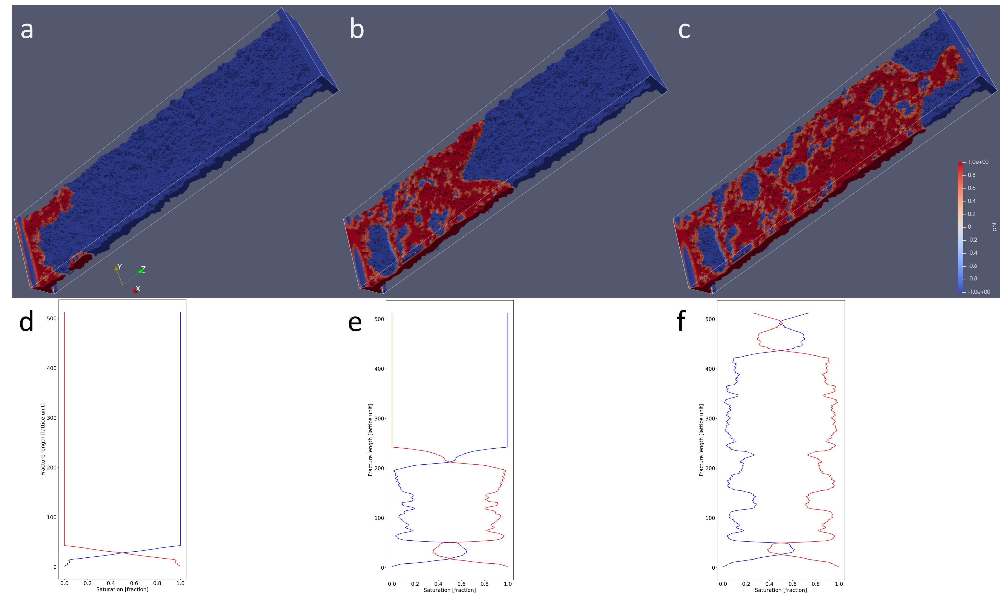

.. _simfrac-gallery:

Image Gallery 
========================================

Spectral Surface Example
^^^^^^^^^^^^^^^^^^^^^^^^^^

.. figure:: figures/spectral.png
   :alt: Figure Not Found
   :align: center
    
   *Fracture surface generated using the spectral method*

Gaussian Surface Example
^^^^^^^^^^^^^^^^^^^^^^^^^^

.. figure:: figures/gaussian.png
   :alt: Figure Not Found
   :align: center
    
   *Fracture surface generated using the Gaussian method*

Combined Surface Example
^^^^^^^^^^^^^^^^^^^^^^^^^^

.. figure:: figures/combined.png
   :alt: Figure Not Found
   :align: center
    
   *Fracture surface generated using the combined method*

MF-LPM Example
^^^^^^^^^^^^^^^^^^^^^^^^^^

   *With the snapshots shown in example Figure, we see an increase in the occupancy of the red phase as injection proceeds.*

dfnWorks Example
^^^^^^^^^^^^^^^^^^^^^^^^^^

.. figure:: figures/DFN_mesh.png
   :alt: Figure Not Found
   :align: center
    
   *Fracture surface generated using the spectral method*

