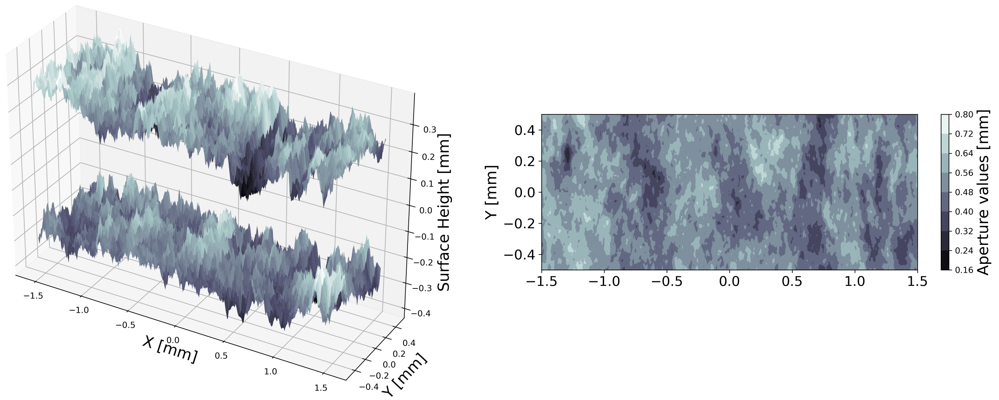
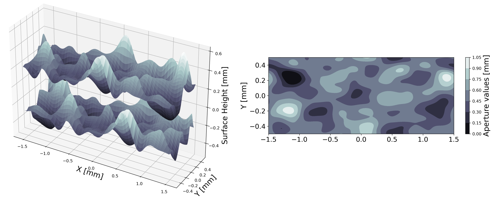
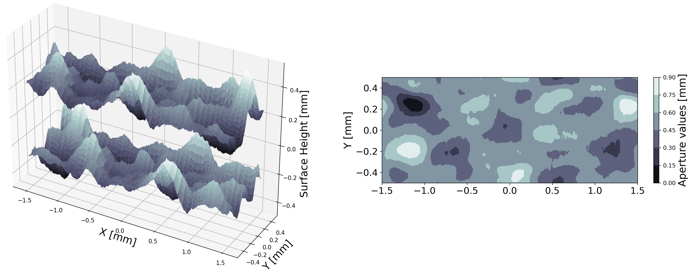

.. _simfrac-methods:

Generation Methods
*****************************

SimFrac has multiple generation methods to produce rough fracture surfaces.  The methods can be broken into two primary categories.  The first set of techniques are spectral methods that produces self-affine/fractal surfaces. The section set are convolution-based.  Below we discuss each of the methods and provide examples of each.  In addition to generating synthetic fractures, SimFrac can be used to read in profilometry of fracture surfaces obtained in the laboratory.

SimFrac Object
====================
Each surface is a SimFrac object. 

.. autoclass:: pysimfrac.src.general.SimFrac  

.. code-block:: python

        myFrac = SimFrac(h = 0.01, lx = 1, ly = 1, 
                        method = "spectral",  
                        units = 'mm')

Spectral
===========

Method Description 
----------------------

Rough fracture surfaces have been represented by fractal/self-affine models. At a first order approximation, The Fourier decomposition of a rough surface indicates that many non-uniform surfaces exhibit a power spectral density function of the form 

.. math::
        G(k) = C k^{-\alpha}

where :math:`k = 2 \pi/\lambda` is the wave number/Fourier mode, :math:`\lambda` is the wavelength, :math:`C` is a proportionality constant, and :math:`\alpha` is the decay exponent.  Based on these observations, a number of spectral/Fourier based rough surface generation methods have been proposed, the most common being (Brown 1995), (Glover et al. 1998), and (Ogilvie et al. 2006).

While there are differences and chronological improvements between these method, the core portion of the algorithms are fairly consistent. The methods all modify the amplitude and phases of the Fourier components of the surfaces. The amplitudes are scaled according to the equation above and the phases are controlled using streams of random numbers. Special care is taken to define the random numbers which define phase, see Ogilvie et al. 2006 for a detailed discussion. The desired fractal dimension and autocorrelation of the surface is often defined in terms of the Hurst exponent which is in a particular sense related to :math:`\alpha` in the equation above. These features along with anisotropy are included into the method via the amplitudes of the decomposition. The spectral method implemented in pySimFrac has the following parameters

        1. Mean aperture value; range :math:`\gt 0`
              
        2. Roughness/standard deviation of heights; range :math:`\geq 0`
        
        3. Hurst exponent with range; range (0,1)
        
        4. Anisotropy ratio; range (0,1)
        
        5. :math:`\lambda_0` roll-off length scale as a fraction of fracture size; range [0,1]
        
        6. Mismatch length scale (wavelength) as a fraction of fracture size [0,1] 

        7. Power spectral density model roll-off function (linear/bilinear/smooth)

 
Example 
----------------------

.. code-block:: python

        Spectral = SimFrac(h = 0.01, lx = 3, ly = 1, 
                        method = "spectral", 
                        units = 'mm')

        Spectral.params["roughness"]["value"] = 0.05
        Spectral.params["mean-aperture"]["value"] = 1.0
        Spectral.params["H"]["value"] = 0.5
        Spectral.params["aniso"]["value"] = 0.5
        Spectral.params["mismatch"]["value"] = 0.1
        Spectral.params["model"]["value"] = "smooth"
        Spectral.create_fracture()

    
   *Fracture surface generated using the spectral method*

Source code 
----------------------

.. automodule:: pysimfrac.src.methods.spectral  
        :members: create_spectral, check_spectral_parameters, initialize_spectral_parameters
        :noindex:
       

Convolution
======================

The convolution methods are based on creating a stationary random topography by convolving an uncorrelated random field :math:`(u(x)) \sim U[0,1])` with a specified kernel :math:`(k(x))`

.. math::
    T(x) = \int dy~k(x - y) \ast u(x).

The structure  of the :math:`T(x)` (moments, correlation, and anisotropy)  are determined by the central limit theorem and the properties of the kernel.
pySimFrac has several built in kernels. 

The convolution method implemented in pySimFrac has the following parameters

        1. Mean Aperture 
        
        2. Aperture Log-Variance
        
        3. :math:`\lambda_x`  Correlation length in :math:`x` direction   
        
        4. :math:`\lambda_y`  Correlation length in :math:`y` direction  

Gaussian
----------------------

Method Description 
^^^^^^^^^^^^^^^^^^^^^^

The primary kernel is a multi-variant 2-dimensional Gaussian function of the form

.. math::
        k(x) = \frac{1}{2 \pi \sqrt{Det(\Lambda)}}\exp\left [ -x^\prime \Lambda x/2 \right]

Example
^^^^^^^^^^^^^^^^^

.. code-block:: python

        Gaussian = SimFrac(method = "gaussian", h= 0.01, lx = 3, ly = 1, units = 'mm')
        Gaussian.mean_aperture = 0.5
        Gaussian.params["mean-aperture"]["value"] = 0.5
        Gaussian.params["aperture-log-variance"]["value"] = 0.01
        Gaussian.params["lambda_x"]["value"] = 0.15
        Gaussian.params["lambda_y"]["value"] = 0.25
        Gaussian.shear = 0.5
        Gaussian.create_fracture()

Example Figure:

    
   *Fracture surface generated using the convolution method and the Gaussian kernel*

Source code 
^^^^^^^^^^^^^^^^^^^^^^

.. automodule:: pysimfrac.src.methods.gaussian  
        :members: create_gaussian, check_gaussian_parameters, initialize_gaussian_parameters
        :noindex: 

Box 
----------------------

Method Description 
^^^^^^^^^^^^^^^^^^^^^^

In addition to the Gaussian kernel, there is a uniform or box function kernel available in pySimFrac, and the inclusion of additional kernels is straightforward and an area of active development.

Example
^^^^^^^^^^^^^^^^^

.. code-block:: python

        Gaussian = SimFrac(method = "box", h= 0.01, lx = 3, ly = 1, units = 'mm')
        Gaussian.mean_aperture = 0.5
        Gaussian.params["mean-aperture"]["value"] = 0.5
        Gaussian.params["aperture-log-variance"]["value"] = 0.01
        Gaussian.params["lambda_x"]["value"] = 0.15
        Gaussian.params["lambda_y"]["value"] = 0.25
        Gaussian.shear = 0.5
        Gaussian.create_fracture()

Source code 
^^^^^^^^^^^^^^^^^^^^^^

.. automodule:: pysimfrac.src.methods.box  
        :members: create_box, check_box_parameters, initialize_box_parameters
        :noindex: 

Combination
================

Method Description 
----------------------

In addition to the base generation methods detailed above, there are a number of functions in pySimFrac to further manipulate the surfaces. Foremost, one can rescale the mean and variance of the surfaces, jointly or individually, and the mean projected aperture field using any desired value. Next, one can apply horizontal shear to the fracture by shifting the top fracture surface along the x-axis for the desired distance. A key property of the pySimFrac fractures is that they are periodic in both x and y and the shear effectively translates the surface around a torus. Thus, the shear translation does not introduce discontinuities in the surfaces nor shorten the domain size, which could be the case if the surface was not periodic. Maintaining periodicity in x and y is often an important requirement of numerical simulation, particularly when simulating steady state fluid distributions for relative permeability calculations. Finally, pySimFrac surfaces can be combined using weighted linear superposition to create new surfaces. 

       
Example
----------------------

An example of this is shown in the example Figure. Here, we combined the surfaces shown in the Figures for the Spectral and Gaussian methods with 1/4 and 3/4 weights, respectively. The resulting fracture surface inherits the long correlations from the Gaussian kernel convolution surface as well as the local roughness of the spectral method. Any number of fracture objects can be combined.
 

.. code-block:: python
        
        Combined = Spectral.combine_fractures([Gaussian], weights = [0.25, 0.75])

    
   *Fracture surface generated using the combined method*

Source code 
----------------------

.. automodule:: pysimfrac.src.methods.combine_fractures  
        :members: combine_fractures
        :noindex: 

