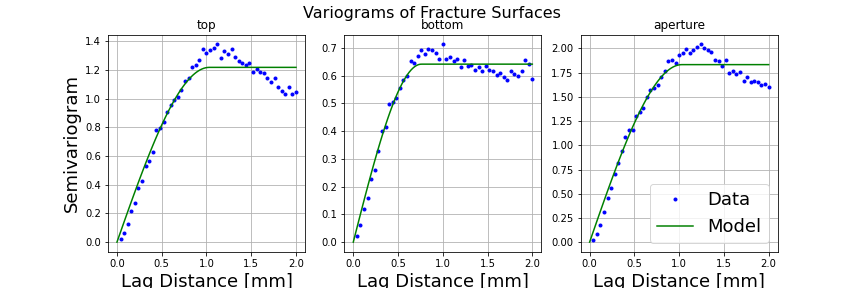
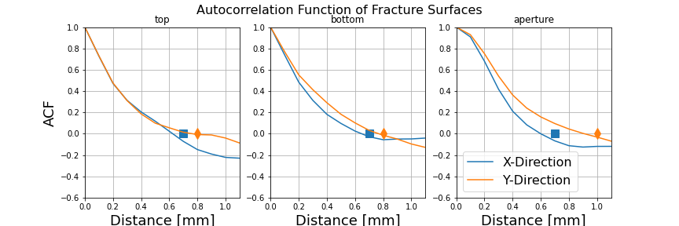

.. _simfrac-geostats:

GeoStatical analysis
========================================

Computing geostatistical information can be measured on fracture surfaces and projected aperture. 

Variogram
^^^^^^^^^^^^^^^^^^^^^^^^
We compute the empirical semivariogram for a surface as 

.. math::
     \hat{\gamma}(h\pm \delta) = \frac{1}{2 |N(h\pm \delta)|} \Sigma_{(i,j)\in N(h \pm \delta)} |z_i - z_j|^2

The variogram is computed using the `skgstat module <https://pypi.org/project/scikit-gstat/>`_. Please see that module for detailed documenation.

.. automodule:: pysimfrac.src.analysis.geostats_variogram
    :members: compute_variogram, single_field_variogram
    :noindex:

To plot the emperical semi-variogram along with model, use plot_variogram described below 

.. automodule:: pysimfrac.src.analysis.geostats_variogram
    :members: plot_variogram
     

    
   *Variogram of a surface generated using the spectral method*

Autocorrelation Function
^^^^^^^^^^^^^^^^^^^^^^^^
We can computer the emperical auto correlation function in x and y directions on each surface. The correlation length in those direcitons is estimated using the first zero crossing of the autocorrelation funciton. 

.. automodule:: pysimfrac.src.analysis.geostats_acf
    :members: compute_acf

.. automodule:: pysimfrac.src.analysis.geostats_acf
    :members: plot_acf
    :noindex:

    
   *Autocorrelation functions of a surface generated using the spectral method*

Probability Density Function
^^^^^^^^^^^^^^^^^^^^^^^^^^^^^^
The empirical probability density of the surfaces can be directly observed. 

PDFs
----------------
.. automodule:: pysimfrac.src.analysis.geostats
    :members: get_surface_pdf

Below is an example of the PDF plot

.. figure:: figures/pdf.png
   :alt: Figure Not Found
   :align: center
    

Moments
----------------
The first four moments of the surface distributions can be directly computed. 

.. automodule:: pysimfrac.src.analysis.geostats
    :members: compute_moments, print_moments
    :noindex:
